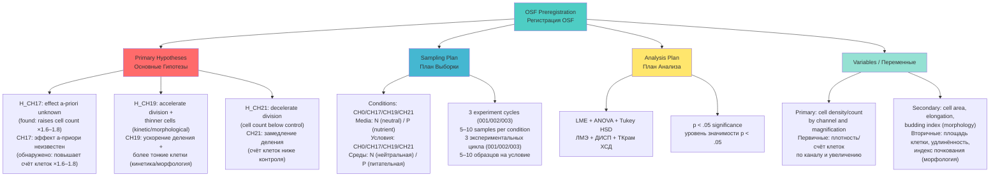

## OSF PREREGISTRATION / ПРЕДВАРИТЕЛЬНАЯ РЕГИСТРАЦИЯ ИССЛЕДОВАНИЯ

**THIS STUDY WAS PREREGISTERED BEFORE DATA COLLECTION:**
**ЭТО ИССЛЕДОВАНИЕ БЫЛО ЗАРЕГИСТРИРОВАНО ДО СБОРА ДАННЫХ:**

### OSF Registration Details / Детали Регистрации OSF

| Parameter / Параметр | Value / Значение |
|----------------------|------------------|
| **Platform / Платформа** | [Open Science Framework (OSF)](https://osf.io/) |
| **Registration Type / Тип Регистрации** | OSF Preregistration |
| **OSF Project ID** | [osf.io/vxkum](https://osf.io/vxkum) |
| **Registration DOI** | [TBD — pending] / [Ожидается] |
| **Date Registered / Дата Регистрации** | 2026-04-04 |
| **Title / Название** | Chrono-Regulatory Effects of Hyperbolic Field Modulation on *Saccharomyces cerevisiae* Cell Dynamics and Morphology |
| **Contributors / Авторы** | Valeria Ovseannicova, Denis Banchenko, Alexandr Ovsyannikov, Mykhailo Kapustin, Kyryl Zmiienko, Ivan Savelyev, Galina Ovseannicova, Eva Ovseannicova |
| **Study Type / Тип Исследования** | Randomized Controlled Experiment (double-blind) / Рандомизированный контролируемый эксперимент (двойное слепое) |
| **Blinding / Ослепление** | Neutral filenames at capture; condition revealed only at aggregation; blind LLM scoring via Claude Opus 4.8 / Нейтральные имена файлов при съёмке; условие раскрывается только при агрегации; слепое LLM-скоринг через Claude Opus 4.8 |
| **License / Лицензия** | CC-BY Attribution-NonCommercial-NoDerivatives 4.0 International |
| **Archive / Архив** | [TBD — not yet archived on archive.org] / [Ещё не заархивировано на archive.org] |

---

### Key Preregistered Elements / Ключевые Элементы Регистрации

---

### Study Design Summary / Краткое Описание Дизайна Исследования

| Element / Элемент | Description / Описание |
|-------------------|------------------------|
| **Primary Hypothesis / Основная Гипотеза** | Exposure of *Saccharomyces cerevisiae* to ASRP hyperbolic field modulation will produce measurable, channel-specific differences in cell density and morphology compared to non-exposed control (CH0) / Воздействие модуляции гиперболическим полем ASRP на *Saccharomyces cerevisiae* вызовет измеримые, канально-специфические различия в плотности клеток и морфологии по сравнению с необлучённым контролем (CH0) |
| **Design / Дизайн** | Randomized, double-blind, controlled; between-subjects (channel) × within-subjects (media N/P, cycle) / Рандомизированный, двойное слепое, контролируемый; межсубъектный (канал) × внутрисубъектный (среда N/P, цикл) |
| **Model Organism / Модельный организм** | *Saccharomyces cerevisiae* (Dr. Oetker dry yeast, 7g, batch L329 M68) |
| **Blinding / Ослепление** | Neutral filenames at image capture; condition codes revealed only at aggregation stage; LLM scoring performed blind via Claude Opus 4.8 / Нейтральные имена файлов при съёмке; коды условий раскрываются только на стадии агрегации; LLM-скоринг проводится слепым методом через Claude Opus 4.8 |
| **Conditions / Условия** | CH0 (control), CH17, CH19, CH21; media N and P |
| **Experiment Cycles / Экспериментальные Циклы** | 3 independent cycles: set 001, set 002, set 003 (biological replicates / биологические повторности) |
| **Magnifications / Увеличения** | 100× (white ring / белый); 10× (yellow ring / жёлтый) |
| **Primary Outcomes / Основные Исходы** | Cell density (count per field, occupancy) at 100× / Плотность клеток (счёт на кадр, занятость) при 100× |
| **Secondary Outcomes / Вторичные Исходы** | Cell morphology: area, elongation, budding index / Морфология: площадь, удлинённость, индекс почкования |
| **Statistical Criteria / Статистические Критерии** | LME (condition × timepoint), Tukey-Kramer post-hoc, p < .05 (two-tailed) / LME (условие × временная точка), пост-хок Тьюки-Крамера, p < .05 (двусторонний) |

---

### Blinding Protocol / Протокол Ослепления

| Stage / Этап | Blind? / Ослеплён? | Detail / Детали |
|---|:---:|---|
| Image capture / Съёмка изображений | Yes / Да | Filenames contain set/magnification codes only; channel not embedded / Имена файлов содержат только код набора/увеличения; канал не включён |
| Computer-vision scoring / CV-скоринг | Yes / Да | Scripts receive paths without channel labels / Скрипты получают пути без меток каналов |
| LLM scoring (Claude Opus 4.8) / LLM-скоринг | Yes / Да | Images presented without channel metadata; model rates density/morphology on visual features alone / Изображения предоставляются без метаданных канала; модель оценивает плотность/морфологию только по визуальным признакам |
| Aggregation / Агрегация | Unblind / Раскрытие | Channel keys applied at final merge; any analyst who scored remains excluded from key application / Ключи каналов применяются при финальном слиянии |
| Statistical analysis / Статистический анализ | Yes / Да | Analyst runs models before inspecting group assignments / Аналитик запускает модели до просмотра назначений групп |

---

### Outcomes / Исходы

#### Primary Outcomes / Первичные Исходы

| Outcome / Исход | Measurement / Измерение | Magnification / Увеличение |
|---|---|:---:|
| **Cell count per field / Счёт клеток на кадр** | Number of segmented cells (YeastSAM) per microscopy field / Количество сегментированных клеток (YeastSAM) на кадр | 100× (white / белый) |
| **Cell density — occupancy / Занятость** | Fraction of field area covered by cells (OpenCV) / Доля площади кадра, занятая клетками (OpenCV) | 100× |
| **LLM density score / Оценка плотности LLM** | Ordinal density rating by blind Claude Opus 4.8 (1–5 scale) / Порядковая оценка плотности слепым Claude Opus 4.8 (шкала 1–5) | 100× |

> **Note on 10× / Примечание по 10×:** Cell count is not meaningful at 10× (confluent lawn); occupancy and texture metrics are used instead. / Счёт клеток не информативен при 10× (газонный рост); вместо него используются занятость и текстурные метрики.

#### Secondary Outcomes / Вторичные Исходы

| Outcome / Исход | Measurement / Измерение | Hypothesis Link / Связь с Гипотезой |
|---|---|---|
| **Cell area / Площадь клетки** | Mean cell area in pixels² (YeastSAM segmentation mask) / Средняя площадь клетки в пикс² (маска сегментации YeastSAM) | CH19: smaller/thinner cells expected / ожидаются меньшие/тонкие клетки |
| **Cell elongation / Удлинённость** | Major/minor axis ratio of fitted ellipse / Отношение большой/малой оси подогнанного эллипса | CH19: increased elongation expected / ожидается повышенное удлинение |
| **Budding index / Индекс почкования** | Fraction of cells with visible bud (YeastSAM) / Доля клеток с видимой почкой (YeastSAM) | CH19 accelerates division → higher budding index / ускоряет деление → выше индекс почкования |
| **LLM morphology score / Оценка морфологии LLM** | Ordinal score for cell shape regularity, size uniformity / Порядковая оценка регулярности формы, однородности размеров | All channels / Все каналы |

---

### Experimental Design / Экспериментальный Дизайн

| Parameter / Параметр | Value / Значение |
|---|---|
| **Model Organism / Модельный Организм** | *Saccharomyces cerevisiae* (Dr. Oetker dry yeast, 7g, batch L329 M68) |
| **Irradiation Duration / Длительность Облучения** | 80 minutes (1h 20m) per session / 80 минут за сессию |
| **Emitter Power / Мощность Излучателя** | 60W avg / 144W peak (6 nodes, clean sine wave) / 60Вт средн. / 144Вт пик (6 узлов, чистая синусоида) |
| **Channels / Каналы** | CH0 (control), CH17, CH19, CH21 |
| **Media / Среды** | N — neutral solution; P — nutrient solution / N — нейтральный раствор; P — питательный раствор |
| **Experiment Cycles / Циклы** | 3 cycles: set 001, set 002, set 003 (biological replicates) / 3 цикла: сет 001, 002, 003 (биологические повторности) |
| **Magnifications / Увеличения** | 100× white objective (белый) — cell-level; 10× yellow objective (жёлтый) — population-level / 100× белый объектив — клеточный уровень; 10× жёлтый — уровень популяции |
| **Temperature / Температура** | 10°C (basement / подвал); 18°C (3rd floor lab / лаборатория) |
| **Lighting During Irradiation / Освещение** | Complete darkness; monitored by photoresistors / Полная темнота; контроль фоторезисторами |
| **Viability Assay (registered, not yet applied to first batch) / Анализ жизнеспособности** | Methylene blue staining: 0.1 mg/mL MB + 2% sodium citrate dihydrate / Метиленовый синий 0.1 мг/мл + 2% дигидрат цитрата натрия |
| **Randomization / Рандомизация** | Simple random assignment via RNG at sample level / Простое случайное распределение через ГСЧ |
| **Total Sample Size / Объём Выборки** | N = 25–50 (5–10 per condition) |

#### Channel Predictions / Предсказания по Каналам

| Channel / Канал | Pre-registered Prediction / Зарегистрированное Предсказание | Type / Тип |
|---|---|---|
| **CH0** | Control — no field / Контроль — поле отсутствует | Reference / Референс |
| **CH17** | A-priori unknown; three scenarios: (a) direction similar to CH19, (b) qualitatively different morphological changes, (c) no measurable effect / А-приори неизвестен; три сценария: (a) направление аналогично CH19, (b) качественно иные морфологические изменения, (c) нет эффекта | Exploratory / Исследовательский |
| **CH19** | Accelerated cell division + thinner/more elongated cells; cell count ≈ control or modestly higher; kinetic and morphological outcome, NOT large count increase / Ускорение деления клеток + более тонкие/удлинённые клетки; счёт ≈ контроль или незначительно выше; кинетический и морфологический исход, НЕ большой прирост счёта | Directional / Направленный |
| **CH21** | Decelerated cell division — cell count below control / Замедление деления — счёт клеток ниже контроля | Directional / Направленный |

> **Important clarification / Важное уточнение:** The large cell-count increase observed in preliminary data (cycles 001–003) belongs to **CH17**, not CH19. CH19's pre-registered prediction is kinetic/morphological (thinner cells, faster division), not a count elevation. This distinction was established in the registered protocol prior to result aggregation. / Большой прирост счёта клеток, наблюдаемый в предварительных данных (циклы 001–003), относится к **CH17**, а не к CH19. Зарегистрированное предсказание для CH19 — кинетическое/морфологическое (более тонкие клетки, ускоренное деление), а не рост счёта. Это разграничение установлено в зарегистрированном протоколе до агрегации результатов.

---

### Quick Links / Быстрые Ссылки

| Resource / Ресурс | Link / Ссылка |
|---|---|
| **OSF Registry / Реестр OSF** | [osf.io/vxkum](https://osf.io/vxkum) (2026-04-04) |
| **Registration DOI / DOI Регистрации** | [TBD — pending] / [Ожидается] |
| **Internet Archive / Архив Интернета** | [TBD — not yet archived] / [Ещё не заархивировано] |
| **OSF Components / Компоненты OSF** | Data, Analytic Code, Materials, Papers, Supplements |
| **Related Study: Blood Plasma / Связанное Исследование: Плазма** | [osf.io/8q42f — DOI 10.17605/OSF.IO/GWA9E](https://doi.org/10.17605/OSF.IO/GWA9E) |

---
