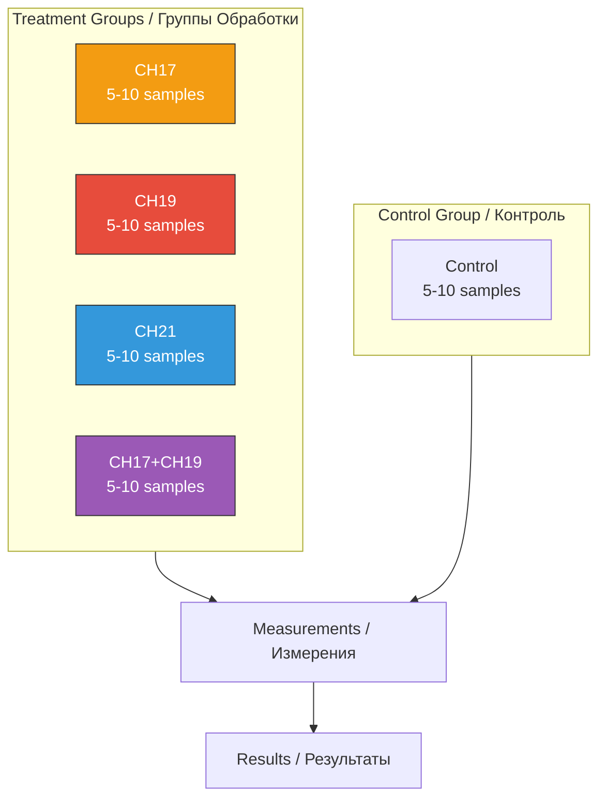
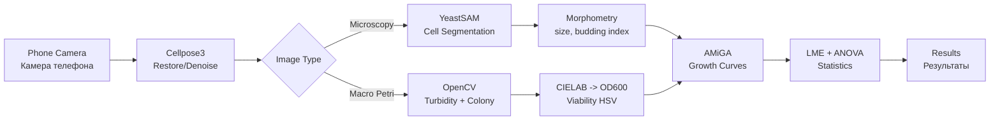
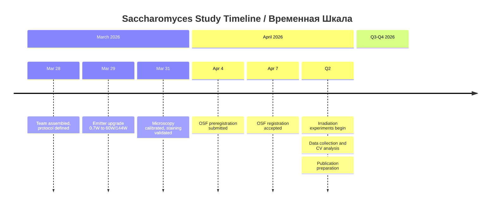
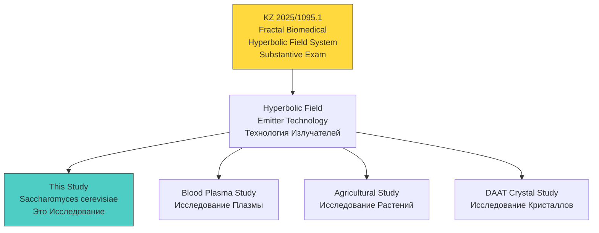

# Hyperbolic Field Saccharomyces Cerevisiae Study / Исследование Влияния Гиперболических Полей на Saccharomyces Cerevisiae

## Chrono-Regulatory Effects of Hyperbolic Field Modulation on Saccharomyces cerevisiae Fermentation Dynamics

<div align="center">

**Хроно-Регуляторные Эффекты Модуляции Гиперболическим Полем на Динамику Ферментации Saccharomyces cerevisiae**

[](https://github.com/AdvancedScientificResearchProjects)
[]()
[]()
[](https://osf.io/Jgt3h)
[](https://creativecommons.org/licenses/by-nc-nd/4.0/)

**Part of Advanced Scientific Research Projects (ASRP) Ecosystem**

**Часть Экосистемы ASRP**

</div>

---

## QUICK NAVIGATION / БЫСТРАЯ НАВИГАЦИЯ

| Section / Раздел | Description / Описание | Status / Статус |
|------------------|----------------------|-----------------|
| [Overview / Обзор](#overview--обзор) | Study objectives / Цели исследования | Defined / Определено |
| [Key Metrics / Метрики](#key-metrics--ключевые-метрики) | Study parameters / Параметры | Defined / Определено |
| [Hypotheses / Гипотезы](#hypotheses--гипотезы) | 11 registered hypotheses / 11 зарегистрированных гипотез | OSF Registered |
| [Experimental Design / Дизайн](#experimental-design--экспериментальный-дизайн) | RCT, N=25-50, double-blind / РКИ, двойное слепое | Protocol ready |
| [Outcome Variables / Переменные](#outcome-variables--переменные-исхода) | FAI, FDI, FPI indices / Индексы | Defined / Определены |
| [Analysis Pipeline / Пайплайн](#analysis-pipeline--аналитический-пайплайн) | Cellpose3 + YeastSAM + AMiGA | Planned |
| [Statistical Analysis / Статистика](#statistical-analysis--статистический-анализ) | LME + ANOVA + Tukey | Defined |
| [Equipment / Оборудование](#equipment--оборудование) | Emitters, sensors, microscope | Upgraded / Обновлено |
| [Team / Команда](#research-team--команда) | 7 researchers / 7 исследователей | Assigned / Назначены |
| [OSF Preregistration / OSF](#osf-preregistration--предварительная-регистрация-osf) | osf.io/vxkum | Registered / Зарегистрировано |
| [Patent Connection / Патент](#patent-connection--связь-с-патентом) | KZ 2025/1095.1 | Substantive Exam |
| [ASRP Ecosystem / Экосистема](#asrp-ecosystem--экосистема-asrp) | Related repos / Связанные репо | Linked |

---

## OVERVIEW / ОБЗОР

### EN

This research project investigates the effects of hyperbolic field modulation on biological process dynamics using *Saccharomyces cerevisiae* as a model system. The study is part of a broader research program focused on chrono-regulatory and biochronal mechanisms in living systems.

The central objective is to determine whether controlled exposure to a structured physical field can induce measurable changes in fermentation kinetics, metabolic activity, and temporal organization of biochemical processes. Yeast fermentation provides a well-characterized and quantifiable system for assessing rate-based biological responses under controlled experimental conditions.

The study employs a controlled experimental design comparing exposed and non-exposed samples, with continuous and time-resolved measurements of fermentation dynamics. Primary outcome measures include fermentation rate, gas production, and temporal progression of metabolic activity.

This work aims to establish a reproducible experimental framework for investigating field-mediated modulation of biological systems, with potential implications for broader applications in biophysics, systems biology, and non-pharmacological regulation of biological processes.

All experimental materials, protocols, and data will be made available via the associated OSF project and integrated GitHub repository to ensure transparency and reproducibility.

### RU

Данный исследовательский проект изучает влияние модуляции гиперболическим полем на динамику биологических процессов с использованием *Saccharomyces cerevisiae* в качестве модельной системы. Исследование является частью более широкой программы, сфокусированной на хроно-регуляторных и биохронных механизмах в живых системах.

Центральная задача -- определить, может ли контролируемое воздействие структурированного физического поля вызвать измеримые изменения в кинетике ферментации, метаболической активности и временной организации биохимических процессов. Дрожжевая ферментация обеспечивает хорошо охарактеризованную и количественно измеримую систему для оценки биологических ответов на основе скорости в контролируемых экспериментальных условиях.

Исследование использует контролируемый экспериментальный дизайн, сравнивающий облучённые и необлучённые образцы, с непрерывными и временно-разрешёнными измерениями динамики ферментации. Первичные исходные показатели включают скорость ферментации, газообразование и временную прогрессию метаболической активности.

Все экспериментальные материалы, протоколы и данные будут доступны через проект OSF и интегрированный репозиторий GitHub для обеспечения прозрачности и воспроизводимости.

---

## KEY METRICS / КЛЮЧЕВЫЕ МЕТРИКИ

| Parameter / Параметр | Value / Значение |
|---------------------|-----------------|
| **Model Organism / Модельный организм** | *Saccharomyces cerevisiae* (Dr. Oetker dry yeast, 7g, batch L329 M68) |
| **Study Type / Тип исследования** | Randomized Controlled Experiment, double-blind / Рандомизированный контролируемый эксперимент, двойное слепое |
| **Irradiation Duration / Длительность облучения** | 80 minutes (1h 20m) per session |
| **Channels / Каналы** | CH17, CH19, CH21, CH17+CH19 |
| **Samples per Condition / Образцов на условие** | 5-10 independent samples |
| **Total Sample Size / Общий размер выборки** | N = 25-50 |
| **Blinding / Ослепление** | Double-blind: coded identifiers, researchers unaware of conditions during analysis / Двойное слепое: кодированные идентификаторы |
| **Randomization / Рандомизация** | Simple random assignment via RNG / Простая рандомизация через ГСЧ |
| **Emitter Power / Мощность излучателя** | 60W avg / 144W peak (6 nodes, clean sine wave) |
| **Temperature / Температура** | 10 C (basement) / 18 C (lab) |
| **Viability Assay / Анализ жизнеспособности** | Methylene blue staining (0.1% MB + 0.01% sodium citrate) |
| **Logging Interval / Интервал логирования** | 1 measurement per minute (~80 per session) |
| **OSF Registration / Регистрация OSF** | [osf.io/vxkum](https://osf.io/vxkum) (Apr 4, 2026) |
| **Patent / Патент** | KZ 2025/1095.1 (Fractal Biomedical Hyperbolic Field System) |

---

## HYPOTHESES / ГИПОТЕЗЫ

*All hypotheses are preregistered on OSF ([osf.io/vxkum](https://osf.io/vxkum)) prior to data collection.*

*Все гипотезы предварительно зарегистрированы на OSF до начала сбора данных.*

### H1: Primary Hypothesis / Основная Гипотеза

Exposure of *Saccharomyces cerevisiae* to hyperbolic field modulation will produce measurable differences in fermentation dynamics compared to non-exposed control samples.

Воздействие модуляции гиперболическим полем на *Saccharomyces cerevisiae* приведёт к измеримым различиям в динамике ферментации по сравнению с необлучёнными контрольными образцами.

### H2: Channel-Specific Effects / Канал-Специфические Эффекты

Different hyperbolic field configurations (CH19, CH21, CH17) will produce distinct and measurable effects on fermentation dynamics compared to control conditions.

Различные конфигурации гиперболического поля (CH19, CH21, CH17) вызовут отчётливые и измеримые эффекты на динамику ферментации по сравнению с контролем.

### H3: Directional Channel Hypothesis / Направленная Канальная Гипотеза

Based on prior observations in plasma systems, it is expected that CH19 exposure will be associated with increased fermentation activity (e.g., faster metabolic dynamics), while CH21 exposure will be associated with reduced or delayed activity relative to control samples.

На основе предыдущих наблюдений в плазменных системах ожидается, что воздействие CH19 будет ассоциировано с повышенной активностью ферментации, а CH21 -- со сниженной или замедленной активностью относительно контроля.

### H4: Temporal Dynamics / Временная Динамика

If hyperbolic field effects persist beyond the exposure period, differences between experimental conditions will increase over time, becoming more pronounced at later observation points (e.g., 12 hours post-exposure).

Если эффекты гиперболического поля сохраняются после периода воздействия, различия между условиями будут увеличиваться со временем, становясь более выраженными в поздних точках наблюдения.

### H5: Transient Effect / Транзитный Эффект

If the effect is limited to the exposure period, differences between conditions will be observable during or immediately after exposure but will not significantly increase after the field is turned off.

Если эффект ограничен периодом воздействия, различия будут наблюдаемы во время или сразу после, но не будут значимо увеличиваться после отключения поля.

### H6: Immediate Morphological Effect / Немедленный Морфологический Эффект

Hyperbolic field exposure may induce immediate observable changes in sample properties (e.g., turbidity, texture, or visible morphology) during or immediately after exposure.

Воздействие может вызвать немедленные наблюдаемые изменения свойств образца (мутность, текстура, видимая морфология) во время или сразу после воздействия.

### H7: CH17 Uncertainty / Неопределённость CH17

The effect of CH17 is currently unknown. It may (a) produce a weaker directional effect similar to CH19, (b) induce qualitatively different changes (e.g., morphological alterations), or (c) produce no measurable effect compared to control.

Эффект CH17 в настоящее время неизвестен. Он может (a) дать более слабый направленный эффект, аналогичный CH19, (b) вызвать качественно иные изменения, или (c) не дать измеримого эффекта.

### H8: Exploratory Variability / Исследовательская Вариабельность

Exposure may alter the variability and consistency of fermentation dynamics across samples, reflecting potential non-linear or system-level responses.

Воздействие может изменить вариабельность и консистентность динамики ферментации между образцами, отражая потенциальные нелинейные или системные ответы.

### H9: Combined Channel Interaction / Взаимодействие Комбинированных Каналов

Simultaneous exposure to multiple hyperbolic field configurations (e.g., CH17 + CH19) may produce interaction effects on fermentation dynamics that differ from the effects of individual channels.

Одновременное воздействие нескольких конфигураций (CH17 + CH19) может вызвать эффекты взаимодействия, отличающиеся от эффектов отдельных каналов.

### H10: Additive vs Non-Linear Effects / Аддитивные vs Нелинейные Эффекты

Combined exposure may result in (a) additive effects (sum of individual channel effects), (b) synergistic amplification, or (c) antagonistic interactions, leading to outcomes that are not predictable from single-channel conditions.

Комбинированное воздействие может привести к (a) аддитивным эффектам, (b) синергетическому усилению, или (c) антагонистическим взаимодействиям.

### H11: Directional Combination / Направленная Комбинация

If CH19 is associated with increased activity and CH17 exhibits a similar or intermediate effect, combined exposure (CH17 + CH19) may lead to enhanced fermentation dynamics compared to either channel alone.

Если CH19 ассоциирован с повышенной активностью, а CH17 демонстрирует аналогичный или промежуточный эффект, комбинированное воздействие может привести к усиленной динамике ферментации по сравнению с каждым каналом в отдельности.

---

## EXPERIMENTAL DESIGN / ЭКСПЕРИМЕНТАЛЬНЫЙ ДИЗАЙН

### Design Type / Тип Дизайна

| Parameter / Параметр | Value / Значение |
|---------------------|-----------------|
| **Type / Тип** | Randomized, double-blind, controlled / Рандомизированный, двойное слепое, контролируемый |
| **Groups / Группы** | Control, CH19, CH21, CH17, CH17+CH19 |
| **Samples per Group / Образцов на группу** | 5-10 independent samples |
| **Total N** | 25-50 |
| **Blinding / Ослепление** | Coded sample identifiers; researchers unaware of conditions during analysis |
| **Randomization / Рандомизация** | Simple random assignment via RNG at sample level |

### Sample Groups / Группы Образцов



### Channel Predictions / Предсказания по Каналам

| Channel / Канал | Effect / Эффект | Plasma Precedent / Прецедент Плазмы |
|----------------|----------------|--------------------------------------|
| **CH19** | Accelerated fermentation phases / Ускорение фаз ферментации | Most coagulated + lysis / Максимальная коагуляция + лизис |
| **CH21** | Delayed fermentation phases / Замедление фаз ферментации | Lagged behind control / Отставал от контроля |
| **CH17** | Unknown -- 3 scenarios (H7) / Неизвестен -- 3 сценария | Found in blue whale research / Найден в исследовании голубых китов |
| **CH17+CH19** | Interaction effects (H9, H10, H11) / Эффекты взаимодействия | Not tested in plasma / Не тестировался на плазме |

### Environment / Среда

| Parameter / Параметр | Value / Значение |
|---------------------|-----------------|
| **Location / Место** | Basement (-1 floor) / Подвал (-1 этаж) |
| **Lighting / Освещение** | Complete darkness during irradiation / Полная темнота при облучении |
| **Temperature / Температура** | 10 C (basement); 18 C (3rd floor lab) |
| **Light monitoring / Мониторинг света** | Photoresistors / Фоторезисторы |

### Observation Schedule / График Наблюдений

| Timepoint / Момент | Action / Действие |
|--------------------|-------------------|
| Before irradiation / До облучения | Photograph + microscopy |
| Immediately after / Сразу после | Photograph + microscopy |
| 3h post-exposure / 3ч после | Photograph |
| 6h | Photograph |
| 12h | Photograph + microscopy |
| 24h | Photograph + microscopy + staining |
| 48h | Photograph + microscopy + staining |

### Viability Assay / Анализ Жизнеспособности

**Methylene Blue Staining / Окрашивание Метиленовым Синим:**
- 100 uL cell suspension + 100 uL methylene blue (0.1 mg/mL in 2% sodium citrate dihydrate)
- 5 min incubation at room temperature
- Dead cells stain blue (cannot reduce dye) / Мёртвые клетки окрашиваются синим
- Live cells remain unstained (reduce dye) / Живые клетки не окрашиваются
- Budding cells with slight staining count as live / Почкующиеся клетки с лёгкой окраской считать живыми

---

## OUTCOME VARIABLES / ПЕРЕМЕННЫЕ ИСХОДА

### Primary Outcomes / Первичные Показатели

| Variable / Переменная | Measurement / Измерение |
|----------------------|------------------------|
| **Fermentation activity (rate)** | Observable gas production and turbidity changes over time / Газообразование и изменение мутности |
| **Time to fermentation onset** | Time from start to visible signs of activity / Время до видимых признаков активности |
| **Fermentation progression dynamics** | Temporal evolution across predefined timepoints / Временная эволюция по точкам наблюдения |
| **Qualitative morphology (exploratory)** | Turbidity patterns, texture, growth characteristics / Паттерны мутности, текстура, рост |

### Derived Indices / Производные Индексы

| Index / Индекс | Formula / Формула | Description / Описание |
|----------------|-------------------|----------------------|
| **FAI (Fermentation Activity Index)** | AUC_condition / AUC_control | Relative fermentation activity / Относительная активность |
| **FDI (Fermentation Delay Index)** | lag_condition - lag_control | Lag phase difference / Разница лаг-фаз |
| **FPI (Fermentation Progression Index)** | umax_condition / umax_control | Maximum growth rate ratio / Отношение максимальных скоростей |

### Control Variables / Контрольные Переменные

Temperature, medium composition, container type, time from preparation to exposure.

---

## ANALYSIS PIPELINE / АНАЛИТИЧЕСКИЙ ПАЙПЛАЙН

### Stack Overview / Обзор Стека

| Task / Задача | Tool / Инструмент | Rationale / Обоснование |
|--------------|------------------|------------------------|
| **Image denoising** | Cellpose3 one-click restore | Handles phone-through-eyepiece noise, blur, vignetting |
| **Cell segmentation** | YeastSAM | 72% accuracy on budding cells vs 9-18% Cellpose3 |
| **Colony counting (macro)** | ImageJ/Fiji via PyImageJ | Validated for CFU, mature tool |
| **Turbidity (OD600 proxy)** | CIELAB regression (OpenCV) | R^2=0.81 on S. cerevisiae with iPhone |
| **Viability scoring** | OpenCV LAB b* channel | Per-setup calibration required |
| **Growth curves** | AMiGA (Gaussian Process) | Non-parametric, auto phase detection, publishable |
| **Statistics** | LME (statsmodels) + Tukey | More powerful than ANOVA for repeated measures |
| **Annotation/QC** | napari + YeastSAM plugin | Native Python integration, human-in-the-loop |

### Pipeline Architecture / Архитектура Пайплайна



### Dependencies / Зависимости

```
cellpose>=3.0.0          # image restoration + yeast models
yeastsam                 # budding cell segmentation
opencv-python>=4.9.0     # preprocessing, turbidity, viability
scikit-image>=0.22.0     # morphometry
napari>=0.4.19           # interactive QC
amiga                    # growth curve fitting (GP regression)
scipy>=1.12.0            # curve fitting
statsmodels>=0.14.0      # LME models
pingouin>=0.5.4          # ANOVA + effect sizes
matplotlib>=3.8.0        # visualization
seaborn>=0.13.0          # statistical plots
pandas>=2.1.0            # data management
```

---

## STATISTICAL ANALYSIS / СТАТИСТИЧЕСКИЙ АНАЛИЗ

### Primary Analysis / Первичный Анализ

Linear Mixed-Effects Model (LME) comparing fermentation dynamics across conditions:

```
log(OD) ~ Condition * Timepoint + (1 | SampleID)
```

- **Between-subject factor:** Exposure condition (Control, CH19, CH21, CH17, CH17+CH19)
- **Within-subject factor:** Time (immediate, 3h, 6h, 12h, 24h, 48h)
- **Post-hoc:** Tukey-adjusted pairwise comparisons
- **Non-parametric alternative:** Kruskal-Wallis if ANOVA assumptions violated
- **Significance threshold:** p < 0.05 (two-tailed)
- **Effect sizes:** Cohen's d, partial eta squared
- **Multiple comparisons:** Tukey HSD for conditions, Bonferroni for timepoints

### Success Criteria / Критерии Успеха

- p < 0.05 on primary outcome
- Moderate effect size (d >= 0.4)
- Transfer to at least one secondary outcome
- Subjective-only effects without quantitative confirmation = weak evidence

### Data Exclusion / Исключение Данных

- Contamination, preparation failure, or recording failure only
- Outliers reported but not removed
- Missing observations not imputed

---

## EQUIPMENT / ОБОРУДОВАНИЕ

| Equipment / Оборудование | Specification / Характеристики |
|--------------------------|-------------------------------|
| **Emitter System / Система излучателей** | 6 nodes, 60W avg / 144W peak, clean sine wave |
| **Temperature Sensors / Датчики температуры** | DHT11 digital (temp + humidity), placed next to each sample |
| **Light Sensors / Датчики света** | Photoresistors + ADC |
| **Microscope / Микроскоп** | Light microscope with strong LED illumination |
| **Data Center / Центр данных** | Linux-based microprocessor, 1 TB storage, auto-logging |
| **Containers / Ёмкости** | Petri dishes / Чашки Петри |
| **Staining Supplies / Реактивы** | Methylene blue 0.1 mg/mL, sodium citrate dihydrate 2%, glass slides |

---

## PRELIMINARY RESULTS / ПРЕДВАРИТЕЛЬНЫЕ РЕЗУЛЬТАТЫ

**Status / Статус:** Setup complete, microscopy calibrated / Установка завершена, микроскопия откалибрована

- Emitter power successfully upgraded from 0.7W to 60W avg / 144W peak
- Clean sine wave output confirmed (no noise/harmonics)
- DHT11 sensors calibrated at 1-minute logging intervals
- Yeast viability confirmed under microscope -- active cell division observed
- Methylene blue staining protocol validated -- clear live/dead differentiation
- Microscope photography workflow established (phone through eyepiece)

**Irradiation experiments not yet started / Эксперименты по облучению ещё не начаты**

---

## TIMELINE / ВРЕМЕННАЯ ШКАЛА



---

## OSF PREREGISTRATION / ПРЕДВАРИТЕЛЬНАЯ РЕГИСТРАЦИЯ OSF

| Field / Поле | Value / Значение |
|--------------|------------------|
| **Status / Статус** | Registered / Зарегистрировано |
| **Project / Проект** | [osf.io/Jgt3h](https://osf.io/Jgt3h) |
| **Registration / Регистрация** | [osf.io/vxkum](https://osf.io/vxkum) |
| **Template / Шаблон** | OSF Preregistration |
| **Registry / Реестр** | OSF Registries |
| **Date Submitted / Дата подачи** | Apr 4, 2026 |
| **Date Accepted / Дата принятия** | Apr 7, 2026 |
| **License / Лицензия** | CC-BY-NC-ND 4.0 International |
| **Contributors / Контрибьюторы** | Valeria Ovseannicova, Denis Banchenko, Alexandr Ovsyannikov, Mykhailo Kapustin, Kyryl Zmiienko, Galina Ovseannicova |

---

## PATENT CONNECTION / СВЯЗЬ С ПАТЕНТОМ



---

## RESEARCH TEAM / КОМАНДА

| Name / ФИО | Role / Роль | Responsibilities / Обязанности |
|-----------|------------|-------------------------------|
| **Valeria Ovsyannikova / Валерия Овсянникова** | Director of Biomedical Research Department / Директор департамента биомедицинских исследований | Hardware, emitter setup, microscopy, staining / Оборудование, установка, микроскопия, окрашивание |
| **Denis Banchenko / Денис Банченко** | Program Director, Author of Methodology & Technology / Директор программы, автор методологии и технологии | Coordination, OSF registration, workflow / Координация, OSF, рабочий процесс |
| **Alexandr Ovsyannikov / Александр Овсянников** | Electrical Engineer / Инженер-электрик | Electrical systems / Электрические системы |
| **Mykhailo Kapustin / Михайло Капустин** | CTO & Director of AI and IT / Технический директор, директор ИИ и ИТ | Data infrastructure / Инфраструктура данных |
| **Kyryl Zmiienko / Кирилл Змиенко** | Chief AI Engineer / Главный ИИ-инженер | Hypothesis formulation, scientific analysis / Формулировка гипотез, научный анализ |
| **Ivan Savelyev / Иван Савельев** | Science Director & Editor-in-Chief ASRP.science / Директор по науке | Data logging protocols, methodology review / Протоколы логирования, обзор методологии |
| **Galina Ovseannicova / Галина Овсянникова** | Researcher / Исследователь | Research support / Поддержка исследований |

---

## KEYWORDS / КЛЮЧЕВЫЕ СЛОВА

**Subjects / Области:** Biomedical Engineering, Medical Microbiology, Biophysics, Systems Biology, Food Microbiology, Environmental Microbiology, Microbiology, Life Sciences, Medical Sciences, Biochemistry

**Tags / Теги:** biochronal processes, biological systems, biophysical fields, chrono-regulation, experimental biophysics, fermentation kinetics, field effects on biology, hyperbolic field, hyperbolic field modulation, non-classical interactions, saccharomyces cerevisiae, yeast fermentation

---

## DATA STRUCTURE / СТРУКТУРА ДАННЫХ

```
Hyperbolic_Field_SaccharomycesCerevisiae_Study/
|
|-- README.md
|
|-- data/
|   |-- equipment/                     # Equipment photos / Фото оборудования
|   |   |-- msg063_photo_valeria_equipment.jpg
|   |   |-- msg064_photo_valeria_equipment2.jpg
|   |   `-- msg094_photo_dht11_sensor_layout.jpg
|   |-- microscopy/                    # Microscopy photos / Фото микроскопии
|   |   |-- msg174_photo_microscope_yeast_concentrate.jpg
|   |   |-- msg185_photo_microscope1.jpg
|   |   |-- msg186_photo_microscope2_reply185.jpg
|   |   `-- staining/                  # Methylene blue staining / Окрашивание
|   |       |-- msg188_photo_stained1.jpg
|   |       |-- msg189_photo_stained2.jpg
|   |       `-- msg190_photo_stained3_reply187.jpg
|   |-- sample-ch17/                   # Channel 17 samples
|   |   `-- photos/
|   |-- sample-ch19/                   # Channel 19 samples
|   |   `-- photos/
|   |-- sample-ch21/                   # Channel 21 samples
|   |   `-- photos/
|   |-- sample-ch17-19/                # Combined CH17+19
|   |   `-- photos/
|   |-- control-01/                    # Control group
|   |   `-- photos/
|   |-- control-02/
|   |   `-- photos/
|   `-- control-03/
|       `-- photos/
|
|-- charts/                            # Analysis charts / Графики
|-- protocols/                         # Experiment protocols / Протоколы
|-- reports/                           # Analysis reports / Отчёты
`-- scripts/                           # CV pipeline scripts / Скрипты CV пайплайна
    |-- ingest.py                      # Image loading + metadata (TBD)
    |-- preprocess.py                  # Flatfield, denoise, crop (TBD)
    |-- segment.py                     # YeastSAM cell segmentation (TBD)
    |-- turbidity.py                   # CIELAB -> OD600 proxy (TBD)
    |-- viability.py                   # Methylene blue scoring (TBD)
    |-- growth_curves.py               # AMiGA fitting (TBD)
    |-- statistics.py                  # LME + ANOVA (TBD)
    `-- visualize.py                   # Charts generation (TBD)
```

---

## ASRP ECOSYSTEM / ЭКОСИСТЕМА ASRP

<div align="center">

### Related Research Repositories / Связанные Исследовательские Репозитории

</div>

| Repository / Репозиторий | Direction / Направление | Link / Ссылка |
|-------------------------|------------------------|---------------|
| **Hyperbolic Field Blood Plasma Study** | Blood plasma coagulation (prior art) / Свёртываемость плазмы | [View / Просмотр](https://github.com/AdvancedScientificResearchProjects/Hyperbolic_Field_BloodPlasma_Study) |
| **Hyperbolic Field Emitter Programs** | Emitter control software / ПО управления излучателями | [View / Просмотр](https://github.com/AdvancedScientificResearchProjects/Hyperbolic_Field_Emitter_Programs) |
| **Hyperbolic Field Agricultural Study** | Plant & seed growth / Рост растений и семян | [View / Просмотр](https://github.com/AdvancedScientificResearchProjects/Hyperbolic_Field_Agricultural_Study) |
| **Hyperbolic Field DAAT Crystal Study** | Crystal-human interaction / Взаимодействие кристалл-человек | [View / Просмотр](https://github.com/AdvancedScientificResearchProjects/Hyperbolic_Field_DAAT_Crystal_Study) |
| **ASRP.art** | Art & consciousness / Искусство и сознание | [View / Просмотр](https://github.com/AdvancedScientificResearchProjects/Axionetic_Sensing_Reactions_Platform_in_Art) |
| **UAP Reverse Engineering** | UAP analysis / Анализ НЛО | [View / Просмотр](https://github.com/AdvancedScientificResearchProjects/UAP_Reverse_Engineering_Study) |

<div align="center">

### Patent Portfolio / Патентный Портфель

</div>

| Patent / Патент | Application / Заявка | Link / Ссылка |
|----------------|---------------------|---------------|
| **Fractal Biomedical System** | KZ 2025/1095.1 | [View / Просмотр](https://github.com/denisbanchenko/Kazpatent_Fractal_Biomedical_System_Patent) |
| **ASRP.art** | KZ 2025/0592.1 + PCT | [View / Просмотр](https://github.com/denisbanchenko/Kazpatent_Axionetic_Sensing_Reactions_Platform_in_Art_Patent) |
| **ASRP.drift** | KZ 413554 | [View / Просмотр](https://github.com/denisbanchenko/Kazpatent_Advanced_Synchro_Resonance_Platform_For_Deep_Resonant_Patent) |
| **GFS** | KZ 2025/1096.1 | [View / Просмотр](https://github.com/denisbanchenko/Kazpatent_Global_Forecasting_System_Patent) |
| **Inspira-X** | KZ 2025/0914.1 | [View / Просмотр](https://github.com/denisbanchenko/Kazpatent_Inspira-X_Respiratory_Analysis_Patent) |
| **Biophotonic** | KZ 2025/1097.1 | [View / Просмотр](https://github.com/denisbanchenko/Kazpatent_Biophotonic_Neurodiagnostic_System_Patent) |

---

## CONTACT INFORMATION / КОНТАКТНАЯ ИНФОРМАЦИЯ

| Field / Поле | Value / Значение |
|--------------|------------------|
| **Organization / Организация** | Advanced Scientific Research Projects LLP / ТОО "Перспективные Научно-Исследовательские Разработки" |
| **Address / Адрес** | Komarova St. 37, Apt 56, Baikonur, 468320 / Ул. Комарова 37, кв. 56, г. Байконур, 468320 |
| **Country / Страна** | Republic of Kazakhstan / Республика Казахстан |
| **Website / Веб-сайт** | [asrp.tech](https://asrp.tech) |
| **Email** | info@asrp.tech |

---

## LICENSE / ЛИЦЕНЗИЯ

CC-BY-NC-ND 4.0 International

This work is licensed under the Creative Commons Attribution-NonCommercial-NoDerivatives 4.0 International License.

---

<div align="center">

**Last Updated / Последнее обновление:** April 2026

**Status / Статус:** Setup Complete, Irradiation Pending / Установка завершена, облучение ожидается

</div>

---

## TBD

- Petri dish photos from experiments / Фото чашек Петри из экспериментов
- Irradiation experiment results / Результаты облучения
- CV pipeline scripts implementation / Реализация скриптов CV пайплайна
- OD600 calibration curve / Калибровочная кривая OD600

---

## NAVIGATION INDEX / НАВИГАЦИОННЫЙ ИНДЕКС

[Overview / Обзор](#overview--обзор) · [Key Metrics / Метрики](#key-metrics--ключевые-метрики) · [Hypotheses / Гипотезы](#hypotheses--гипотезы) · [Experimental Design / Дизайн](#experimental-design--экспериментальный-дизайн) · [Outcome Variables / Переменные](#outcome-variables--переменные-исхода) · [Analysis Pipeline / Пайплайн](#analysis-pipeline--аналитический-пайплайн) · [Statistical Analysis / Статистика](#statistical-analysis--статистический-анализ) · [Equipment / Оборудование](#equipment--оборудование) · [Preliminary Results / Результаты](#preliminary-results--предварительные-результаты) · [Timeline / Сроки](#timeline--временная-шкала) · [OSF / Регистрация](#osf-preregistration--предварительная-регистрация-osf) · [Patent / Патент](#patent-connection--связь-с-патентом) · [Team / Команда](#research-team--команда) · [Keywords / Слова](#keywords--ключевые-слова) · [Data Structure / Структура](#data-structure--структура-данных) · [ASRP Ecosystem / Экосистема](#asrp-ecosystem--экосистема-asrp) · [Contact / Контакты](#contact-information--контактная-информация) · [License / Лицензия](#license--лицензия)
