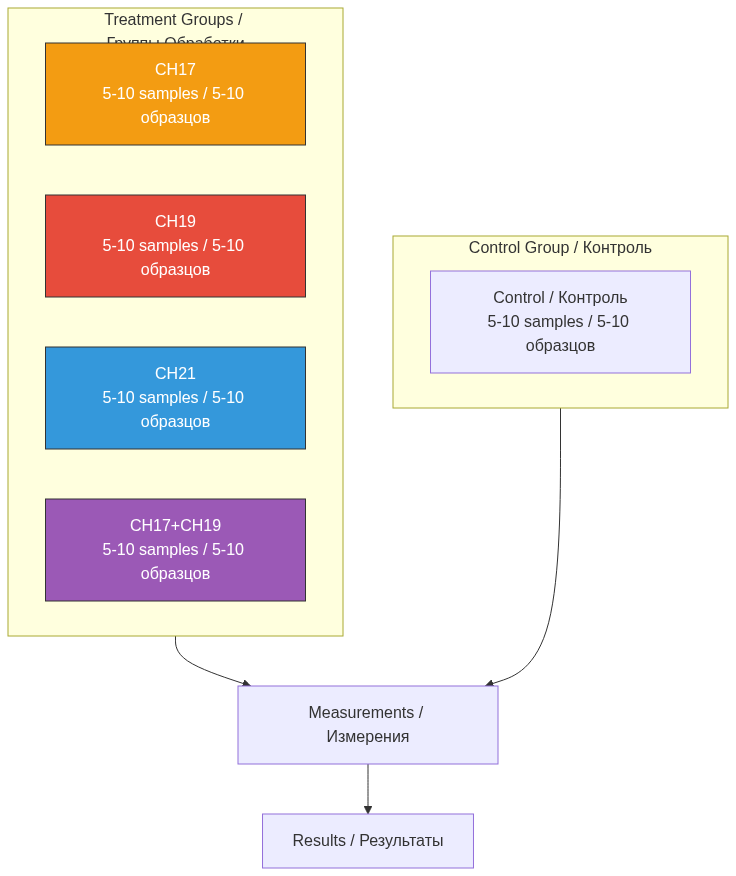
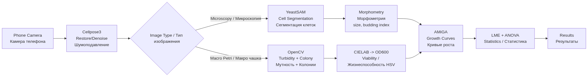
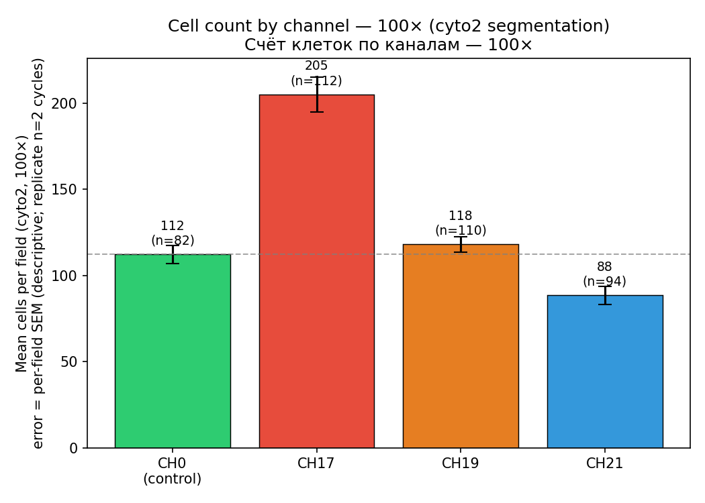
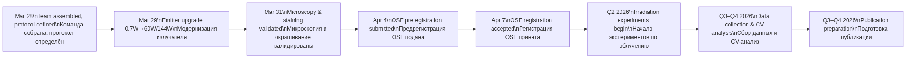
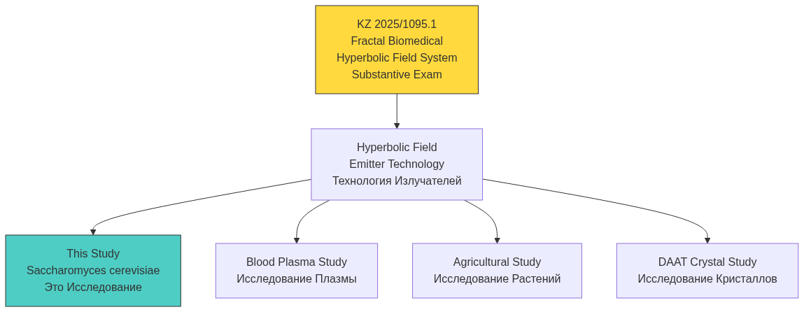

# Hyperbolic Field Saccharomyces Cerevisiae Study / Исследование Влияния Гиперболических Полей на Saccharomyces Cerevisiae

## Chrono-Regulatory Effects of Hyperbolic Field Modulation on Saccharomyces cerevisiae Fermentation Dynamics

<div align="center">

**Хроно-Регуляторные Эффекты Модуляции Гиперболическим Полем на Динамику Ферментации Saccharomyces cerevisiae**

[](https://github.com/AdvancedScientificResearchProjects)


[](https://osf.io/vxkum)
[](https://creativecommons.org/licenses/by-nc-nd/4.0/)

**Part of Advanced Scientific Research Projects (ASRP) Ecosystem**

**Часть Экосистемы ASRP**

</div>

---

## QUICK NAVIGATION / БЫСТРАЯ НАВИГАЦИЯ

| Section / Раздел | Description / Описание | Status / Статус |
|------------------|----------------------|-----------------|
| [Key Results / Результаты](#key-results--ключевые-результаты) | CH17 +83%, CH21 −21%, CH19 kinetic / CH17 +83%, CH21 −21%, CH19 кинетика | Preliminary / Предварительно |
| [Overview / Обзор](#overview--обзор) | Study objectives / Цели исследования | Defined / Определено |
| [Key Metrics / Метрики](#key-metrics--ключевые-метрики) | Study parameters / Параметры | Defined / Определено |
| [Hypotheses / Гипотезы](#hypotheses--гипотезы) | 11 registered hypotheses / 11 зарегистрированных гипотез | OSF Registered / Зарегистрировано на OSF |
| [Experimental Design / Дизайн](#experimental-design--экспериментальный-дизайн) | RCT, N=25-50, double-blind / РКИ, двойное слепое | Protocol ready / Протокол готов |
| [Outcome Variables / Переменные](#outcome-variables--переменные-исхода) | FAI, FDI, FPI indices / Индексы | Defined / Определены |
| [Analysis Pipeline / Пайплайн](#analysis-pipeline--аналитический-пайплайн) | Cellpose3 + YeastSAM + AMiGA | Planned / Запланировано |
| [Statistical Analysis / Статистика](#statistical-analysis--статистический-анализ) | LME + ANOVA + Tukey | Defined / Определено |
| [Equipment / Оборудование](#equipment--оборудование) | Emitters, sensors, microscope / Излучатели, датчики, микроскоп | Upgraded / Обновлено |
| [Team / Команда](#research-team--команда) | 8 researchers / 8 исследователей | Assigned / Назначены |
| [OSF Preregistration / OSF](#osf-preregistration--предварительная-регистрация-osf) | osf.io/vxkum | Registered / Зарегистрировано |
| [Patent Connection / Патент](#patent-connection--связь-с-патентом) | KZ 2025/1095.1 | Substantive Exam / Экспертиза по существу |
| [ASRP Ecosystem / Экосистема](#asrp-ecosystem--экосистема-asrp) | Related repos / Связанные репо | Linked / Связано |

---

## OVERVIEW / ОБЗОР

### EN

This research project investigates the effects of hyperbolic field modulation on biological process dynamics using *Saccharomyces cerevisiae* as a model system. The study is part of a broader research program focused on chrono-regulatory and biochronal mechanisms in living systems.

The central objective is to determine whether controlled exposure to a structured physical field can induce measurable changes in fermentation kinetics, metabolic activity, and temporal organization of biochemical processes. Yeast fermentation provides a well-characterized and quantifiable system for assessing rate-based biological responses under controlled experimental conditions.

The study employs a controlled experimental design comparing exposed and non-exposed samples, with continuous and time-resolved measurements of fermentation dynamics. Primary outcome measures include fermentation rate, gas production, and temporal progression of metabolic activity.

This work aims to establish a reproducible experimental framework for investigating field-mediated modulation of biological systems, with potential implications for broader applications in biophysics, systems biology, and non-pharmacological regulation of biological processes.

All experimental materials, protocols, and data will be made available via the associated OSF project and integrated GitHub repository to ensure transparency and reproducibility.

### RU

Данный исследовательский проект изучает влияние модуляции гиперболическим полем на динамику биологических процессов с использованием *Saccharomyces cerevisiae* в качестве модельной системы. Исследование является частью более широкой программы, сфокусированной на хроно-регуляторных и биохронных механизмах в живых системах.

Центральная задача -- определить, может ли контролируемое воздействие структурированного физического поля вызвать измеримые изменения в кинетике ферментации, метаболической активности и временной организации биохимических процессов. Дрожжевая ферментация обеспечивает хорошо охарактеризованную и количественно измеримую систему для оценки биологических ответов на основе скорости в контролируемых экспериментальных условиях.

Исследование использует контролируемый экспериментальный дизайн, сравнивающий облучённые и необлучённые образцы, с непрерывными и временно-разрешёнными измерениями динамики ферментации. Первичные исходные показатели включают скорость ферментации, газообразование и временную прогрессию метаболической активности.

Данная работа направлена на создание воспроизводимой экспериментальной основы для изучения полевой модуляции биологических систем, с потенциальными применениями в биофизике, системной биологии и нефармакологической регуляции биологических процессов.

Все экспериментальные материалы, протоколы и данные будут доступны через проект OSF и интегрированный репозиторий GitHub для обеспечения прозрачности и воспроизводимости.

---

## KEY METRICS / КЛЮЧЕВЫЕ МЕТРИКИ

| Parameter / Параметр | Value / Значение |
|---------------------|-----------------|
| **Model Organism / Модельный организм** | *Saccharomyces cerevisiae* (Dr. Oetker dry yeast, 7g, batch L329 M68) |
| **Study Type / Тип исследования** | Randomized Controlled Experiment, double-blind / Рандомизированный контролируемый эксперимент, двойное слепое |
| **Irradiation Duration / Длительность облучения** | 80 minutes (1h 20m) per session / 80 минут (1ч 20мин) за сессию |
| **Channels / Каналы** | CH17, CH19, CH21, CH17+CH19 |
| **Samples per Condition / Образцов на условие** | 5-10 independent samples / 5-10 независимых образцов |
| **Total Sample Size / Общий размер выборки** | N = 25-50 |
| **Blinding / Ослепление** | Double-blind: coded identifiers, researchers unaware of conditions during analysis / Двойное слепое: кодированные идентификаторы |
| **Randomization / Рандомизация** | Simple random assignment via RNG / Простая рандомизация через ГСЧ |
| **Emitter Power / Мощность излучателя** | 60W avg / 144W peak (6 nodes, clean sine wave / чистая синусоида) |
| **Temperature / Температура** | 10 C (basement) / 18 C (lab) |
| **Viability Assay / Анализ жизнеспособности** | Methylene blue staining (0.1% MB + 0.01% sodium citrate) / Окрашивание метиленовым синим (0.1% МС + 0.01% цитрат натрия) |
| **Logging Interval / Интервал логирования** | 1 measurement per minute (~80 per session) |
| **OSF Registration / Регистрация OSF** | [osf.io/vxkum](https://osf.io/vxkum) (Apr 4, 2026) |
| **Patent / Патент** | KZ 2025/1095.1 (Fractal Biomedical Hyperbolic Field System) |

---

## HYPOTHESES / ГИПОТЕЗЫ

*All hypotheses are preregistered on OSF ([osf.io/vxkum](https://osf.io/vxkum)) prior to data collection.*

*Все гипотезы предварительно зарегистрированы на OSF до начала сбора данных.*

### H1: Primary Hypothesis / Основная Гипотеза

Exposure of *Saccharomyces cerevisiae* to hyperbolic field modulation will produce measurable differences in fermentation dynamics compared to non-exposed control samples.

Воздействие модуляции гиперболическим полем на *Saccharomyces cerevisiae* приведёт к измеримым различиям в динамике ферментации по сравнению с необлучёнными контрольными образцами.

### H2: Channel-Specific Effects / Канал-Специфические Эффекты

Different hyperbolic field configurations (CH19, CH21, CH17) will produce distinct and measurable effects on fermentation dynamics compared to control conditions.

Различные конфигурации гиперболического поля (CH19, CH21, CH17) вызовут отчётливые и измеримые эффекты на динамику ферментации по сравнению с контролем.

### H3: Directional Channel Hypothesis / Направленная Канальная Гипотеза

Based on prior observations in plasma systems (companion Blood Plasma Study, osf.io/8q42f, DOI 10.17605/OSF.IO/GWA9E), it is hypothesised that CH19 exposure will be associated with increased fermentation activity (e.g., faster metabolic dynamics — i.e. accelerated division rate / dynamics, NOT an increase in biomass or cell count; count ≈ control is the expected outcome for CH19; the count increase belongs to CH17), while CH21 exposure will be associated with reduced or delayed activity relative to control samples.

На основе предыдущих наблюдений в плазменных системах (сопутствующее Исследование Плазмы Крови, osf.io/8q42f, DOI 10.17605/OSF.IO/GWA9E) гипотетически ожидается, что воздействие CH19 будет ассоциировано с повышенной активностью ферментации (т.е. ускоренным темпом деления / динамикой, НЕ увеличением биомассы или числа клеток; счёт ≈ контроль — ожидаемый результат для CH19; увеличение числа клеток относится к CH17), а CH21 — со сниженной или замедленной активностью относительно контроля.

### H4: Temporal Dynamics / Временная Динамика

If hyperbolic field effects persist beyond the exposure period, differences between experimental conditions will increase over time, becoming more pronounced at later observation points (e.g., 12 hours post-exposure).

Если эффекты гиперболического поля сохраняются после периода воздействия, различия между условиями будут увеличиваться со временем, становясь более выраженными в поздних точках наблюдения.

### H5: Transient Effect / Транзитный Эффект

If the effect is limited to the exposure period, differences between conditions will be observable during or immediately after exposure but will not significantly increase after the field is turned off.

Если эффект ограничен периодом воздействия, различия будут наблюдаемы во время или сразу после, но не будут значимо увеличиваться после отключения поля.

### H6: Immediate Morphological Effect / Немедленный Морфологический Эффект

Hyperbolic field exposure may induce immediate observable changes in sample properties (e.g., turbidity, texture, or visible morphology) during or immediately after exposure.

Воздействие может вызвать немедленные наблюдаемые изменения свойств образца (мутность, текстура, видимая морфология) во время или сразу после воздействия.

### H7: CH17 Uncertainty / Неопределённость CH17

The effect of CH17 is currently unknown. It may (a) produce a weaker directional effect similar to CH19, (b) induce qualitatively different changes (e.g., morphological alterations), or (c) produce no measurable effect compared to control.

Эффект CH17 в настоящее время неизвестен. Он может (a) дать более слабый направленный эффект, аналогичный CH19, (b) вызвать качественно иные изменения, или (c) не дать измеримого эффекта.

### H8: Exploratory Variability / Исследовательская Вариабельность

Exposure may alter the variability and consistency of fermentation dynamics across samples, reflecting potential non-linear or system-level responses.

Воздействие может изменить вариабельность и консистентность динамики ферментации между образцами, отражая потенциальные нелинейные или системные ответы.

### H9: Combined Channel Interaction / Взаимодействие Комбинированных Каналов

Simultaneous exposure to multiple hyperbolic field configurations (e.g., CH17 + CH19) may produce interaction effects on fermentation dynamics that differ from the effects of individual channels.

Одновременное воздействие нескольких конфигураций (CH17 + CH19) может вызвать эффекты взаимодействия, отличающиеся от эффектов отдельных каналов.

### H10: Additive vs Non-Linear Effects / Аддитивные vs Нелинейные Эффекты

Combined exposure may result in (a) additive effects (sum of individual channel effects), (b) synergistic amplification, or (c) antagonistic interactions, leading to outcomes that are not predictable from single-channel conditions.

Комбинированное воздействие может привести к (a) аддитивным эффектам, (b) синергетическому усилению, или (c) антагонистическим взаимодействиям.

### H11: Directional Combination / Направленная Комбинация

If CH19 is associated with increased activity and CH17 exhibits a similar or intermediate effect, combined exposure (CH17 + CH19) may lead to enhanced fermentation dynamics compared to either channel alone.

Если CH19 ассоциирован с повышенной активностью, а CH17 демонстрирует аналогичный или промежуточный эффект, комбинированное воздействие может привести к усиленной динамике ферментации по сравнению с каждым каналом в отдельности.

---

## EXPERIMENTAL DESIGN / ЭКСПЕРИМЕНТАЛЬНЫЙ ДИЗАЙН

### Design Type / Тип Дизайна

| Parameter / Параметр | Value / Значение |
|---------------------|-----------------|
| **Type / Тип** | Randomized, double-blind, controlled / Рандомизированный, двойное слепое, контролируемый |
| **Groups / Группы** | Control, CH19, CH21, CH17, CH17+CH19 |
| **Samples per Group / Образцов на группу** | 5-10 independent samples / 5-10 независимых образцов |
| **Total N** | 25-50 |
| **Blinding / Ослепление** | Coded sample identifiers; researchers unaware of conditions during analysis / Кодированные идентификаторы образцов; исследователи не знают условий во время анализа |
| **Randomization / Рандомизация** | Simple random assignment via RNG at sample level / Простое случайное распределение через ГСЧ на уровне образца |

### Sample Groups / Группы Образцов



### Channel Predictions / Предсказания по Каналам

| Channel / Канал | Effect / Эффект | Plasma Precedent / Прецедент Плазмы |
|----------------|----------------|--------------------------------------|
| **CH19** | Accelerated fermentation phases / Ускорение фаз ферментации | Most coagulated + lysis / Максимальная коагуляция + лизис |
| **CH21** | Delayed fermentation phases / Замедление фаз ферментации | Lagged behind control / Отставал от контроля |
| **CH17** | Unknown -- 3 scenarios (H7) / Неизвестен -- 3 сценария | Found in blue whale research / Найден в исследовании голубых китов |
| **CH17+CH19** | Interaction effects (H9, H10, H11) / Эффекты взаимодействия | Not tested in plasma / Не тестировался на плазме |

### Environment / Среда

| Parameter / Параметр | Value / Значение |
|---------------------|-----------------|
| **Location / Место** | Basement (-1 floor) / Подвал (-1 этаж) |
| **Lighting / Освещение** | Complete darkness during irradiation / Полная темнота при облучении |
| **Temperature / Температура** | 10 C (basement); 18 C (3rd floor lab) |
| **Light monitoring / Мониторинг света** | Photoresistors / Фоторезисторы |

### Observation Schedule / График Наблюдений

| Timepoint / Момент | Action / Действие |
|--------------------|-------------------|
| Before irradiation / До облучения | Photograph + microscopy / Фотография + микроскопия |
| Immediately after / Сразу после | Photograph + microscopy / Фотография + микроскопия |
| 3h post-exposure / 3ч после | Photograph / Фотография |
| 6h | Photograph / Фотография |
| 12h | Photograph + microscopy / Фотография + микроскопия |
| 24h | Photograph + microscopy + staining / Фотография + микроскопия + окрашивание |
| 48h | Photograph + microscopy + staining / Фотография + микроскопия + окрашивание |

### Viability Assay / Анализ Жизнеспособности

**Methylene Blue Staining / Окрашивание Метиленовым Синим:**
- 100 uL cell suspension + 100 uL methylene blue (0.1 mg/mL in 2% sodium citrate dihydrate) / 100 мкл клеточной суспензии + 100 мкл метиленового синего (0.1 мг/мл в 2% дигидрате цитрата натрия)
- 5 min incubation at room temperature / 5 мин инкубации при комнатной температуре
- Dead cells stain blue (cannot reduce dye) / Мёртвые клетки окрашиваются синим
- Live cells remain unstained (reduce dye) / Живые клетки не окрашиваются
- Budding cells with slight staining count as live / Почкующиеся клетки с лёгкой окраской считать живыми

> **Note / Примечание:** This is the *registered* viability protocol. The **first analysed microscopy batch (2026-06-09, 990 total images / 990 изображений всего — 972 HEIC eyepiece microscopy fields / 972 поля микроскопии HEIC + 18 PNG digital microscopy / 18 PNG цифровой микроскопии) used NO viability stain** (researcher-confirmed; the blue cast in those images is medium/illumination) — so that batch reports cell **density only**, not live/dead viability. Staining / OD600 / fermentation outcomes remain pending. / Это *зарегистрированный* протокол. **Первый проанализированный пакет микроскопии (09.06.2026, 990 изображений всего / 990 total images — 972 поля микроскопии HEIC / 972 HEIC eyepiece microscopy fields + 18 PNG цифровой микроскопии / 18 PNG digital microscopy) окрашивание НЕ использовал** (подтверждено руководителем; синий оттенок — это среда/подсветка) — поэтому он отражает только **плотность клеток**, не жизнеспособность. Окрашивание / OD600 / ферментация — в работе.

---

## OUTCOME VARIABLES / ПЕРЕМЕННЫЕ ИСХОДА

### Primary Outcomes / Первичные Показатели

| Variable / Переменная | Measurement / Измерение |
|----------------------|------------------------|
| **Fermentation activity (rate) / Активность ферментации (скорость)** | Observable gas production and turbidity changes over time / Газообразование и изменение мутности |
| **Time to fermentation onset / Время до начала ферментации** | Time from start to visible signs of activity / Время до видимых признаков активности |
| **Fermentation progression dynamics / Динамика прогрессии ферментации** | Temporal evolution across predefined timepoints / Временная эволюция по точкам наблюдения |
| **Qualitative morphology (exploratory) / Качественная морфология (поисковая)** | Turbidity patterns, texture, growth characteristics / Паттерны мутности, текстура, рост |

### Derived Indices / Производные Индексы

| Index / Индекс | Formula / Формула | Description / Описание |
|----------------|-------------------|----------------------|
| **FAI (Fermentation Activity Index) / Индекс Активности Ферментации** | AUC_condition / AUC_control | Relative fermentation activity / Относительная активность |
| **FDI (Fermentation Delay Index) / Индекс Задержки Ферментации** | lag_condition - lag_control | Lag phase difference / Разница лаг-фаз |
| **FPI (Fermentation Progression Index) / Индекс Прогрессии Ферментации** | umax_condition / umax_control | Maximum growth rate ratio / Отношение максимальных скоростей |

### Control Variables / Контрольные Переменные

Temperature, medium composition, container type, time from preparation to exposure.

---

## ANALYSIS PIPELINE / АНАЛИТИЧЕСКИЙ ПАЙПЛАЙН

### Stack Overview / Обзор Стека

| Task / Задача | Tool / Инструмент | Rationale / Обоснование |
|--------------|------------------|------------------------|
| **Image denoising / Подавление шума** | Cellpose3 one-click restore / Cellpose3 восстановление в один клик | Handles phone-through-eyepiece noise, blur, vignetting / Устраняет шум, размытие, виньетирование при съёмке через окуляр телефоном |
| **Cell segmentation / Сегментация клеток** | YeastSAM | 72% accuracy on budding cells vs 9-18% Cellpose3 / 72% точность на почкующихся клетках vs 9-18% Cellpose3 |
| **Colony counting (macro) / Подсчёт колоний (макро)** | ImageJ/Fiji via PyImageJ / ImageJ/Fiji через PyImageJ | Validated for CFU, mature tool / Валидирован для КОЕ, зрелый инструмент |
| **Turbidity (OD600 proxy) / Мутность (OD600 прокси)** | CIELAB regression (OpenCV) / CIELAB регрессия (OpenCV) | R²=0.81 on S. cerevisiae with iPhone / R²=0.81 на S. cerevisiae с iPhone |
| **Viability scoring / Оценка жизнеспособности** | OpenCV LAB b* channel / Канал b* LAB в OpenCV | Per-setup calibration required / Требуется калибровка для каждой установки |
| **Growth curves / Кривые роста** | AMiGA (Gaussian Process) / AMiGA (Гауссовский процесс) | Non-parametric, auto phase detection, publishable / Непараметрический, автодетекция фаз, пригоден для публикации |
| **Statistics / Статистика** | LME (statsmodels) + Tukey / LME (statsmodels) + Тьюки | More powerful than ANOVA for repeated measures / Мощнее ANOVA для повторных измерений |
| **Annotation/QC / Аннотация/КК** | napari + YeastSAM plugin / napari + плагин YeastSAM | Native Python integration, human-in-the-loop / Нативная интеграция Python, человек-в-цикле |

### Pipeline Architecture / Архитектура Пайплайна



### Dependencies / Зависимости

```
cellpose>=3.0.0          # image restoration + yeast models
yeastsam                 # budding cell segmentation
opencv-python>=4.9.0     # preprocessing, turbidity, viability
scikit-image>=0.22.0     # morphometry
napari>=0.4.19           # interactive QC
amiga                    # growth curve fitting (GP regression)
scipy>=1.12.0            # curve fitting
statsmodels>=0.14.0      # LME models
pingouin>=0.5.4          # ANOVA + effect sizes
matplotlib>=3.8.0        # visualization
seaborn>=0.13.0          # statistical plots
pandas>=2.1.0            # data management
```

---

## STATISTICAL ANALYSIS / СТАТИСТИЧЕСКИЙ АНАЛИЗ

### Primary Analysis / Первичный Анализ

Linear Mixed-Effects Model (LME) comparing fermentation dynamics across conditions / Линейная модель со смешанными эффектами (LME), сравнивающая динамику ферментации по условиям:

```
log(OD) ~ Condition * Timepoint + (1 | SampleID)
```

- **Between-subject factor / Межсубъектный фактор:** Exposure condition (Control, CH19, CH21, CH17, CH17+CH19) / Условие воздействия (Контроль, CH19, CH21, CH17, CH17+CH19)
- **Within-subject factor / Внутрисубъектный фактор:** Time (immediate, 3h, 6h, 12h, 24h, 48h) / Время (сразу, 3ч, 6ч, 12ч, 24ч, 48ч)
- **Post-hoc / Пост-хок:** Tukey-adjusted pairwise comparisons / Попарные сравнения с поправкой Тьюки
- **Non-parametric alternative / Непараметрическая альтернатива:** Kruskal-Wallis if ANOVA assumptions violated / Краскела-Уоллиса, если допущения ANOVA нарушены
- **Significance threshold / Порог значимости:** p < 0.05 (two-tailed) / p < 0.05 (двусторонний)
- **Effect sizes / Размеры эффекта:** Cohen's d, partial eta squared / d Коэна, частичная эта-квадрат
- **Multiple comparisons / Множественные сравнения:** Tukey HSD for conditions, Bonferroni for timepoints / Тьюки HSD для условий, Бонферрони для временных точек

### Success Criteria / Критерии Успеха

- p < 0.05 on primary outcome / p < 0.05 по первичному показателю
- Moderate effect size (d >= 0.4) / Умеренный размер эффекта (d >= 0.4)
- Transfer to at least one secondary outcome / Перенос хотя бы на один вторичный показатель
- Subjective-only effects without quantitative confirmation = weak evidence / Только субъективные эффекты без количественного подтверждения = слабое доказательство

### Data Exclusion / Исключение Данных

- Contamination, preparation failure, or recording failure only / Только контаминация, сбой подготовки или сбой записи
- Outliers reported but not removed / Выбросы сообщаются, но не удаляются
- Missing observations not imputed / Пропущенные наблюдения не импутируются

---

## EQUIPMENT / ОБОРУДОВАНИЕ

| Equipment / Оборудование | Specification / Характеристики |
|--------------------------|-------------------------------|
| **Emitter System / Система излучателей** | 6 nodes, 60W avg / 144W peak, clean sine wave / 6 узлов, 60Вт средн. / 144Вт пик, чистая синусоида |
| **Temperature Sensors / Датчики температуры** | DHT11 digital (temp + humidity), placed next to each sample / Цифровой DHT11 (темп. + влажность), размещён рядом с каждым образцом |
| **Light Sensors / Датчики света** | Photoresistors + ADC / Фоторезисторы + АЦП |
| **Microscope / Микроскоп** | Light microscope with strong LED illumination / Световой микроскоп с мощной светодиодной подсветкой |
| **Data Center / Центр данных** | Linux-based microprocessor, 1 TB storage, auto-logging / Микропроцессор на базе Linux, 1 ТБ хранилища, автологирование |
| **Containers / Ёмкости** | Petri dishes / Чашки Петри |
| **Staining Supplies / Реактивы** | Methylene blue 0.1 mg/mL, sodium citrate dihydrate 2%, glass slides / Метиленовый синий 0.1 мг/мл, дигидрат цитрата натрия 2%, предметные стёкла |

---

## KEY RESULTS / КЛЮЧЕВЫЕ РЕЗУЛЬТАТЫ

**First imaging batch analysed (920 fields, LLM-scored subset / подмножество, оценённое LLM, cycles 001–003). A directional effect on cell density was found across three measurement methods (CV cell count, CV occupancy, blind LLM vision), reproducible in 2 of 3 cycles. CH17 is the strongest growth enhancer; CH21 falls below control (deceleration, as predicted); CH19 matches control by count (its hypothesised kinetic/morphological effect — thinner cells / faster division — is NOT supported on this endpoint batch; see report §9).**

**Проанализирован первый пакет снимков (920 полей, подмножество, оценённое LLM / LLM-scored subset, циклы 001–003). Направленный эффект на плотность клеток подтверждён тремя методами измерения (CV-счёт, CV-занятость, слепой LLM-визион), воспроизводим в 2 из 3 циклов. CH17 — сильнейший стимулятор роста; CH21 — ниже контроля (замедление, как и предсказано); CH19 совпадает с контролем по числу клеток (его предполагаемый кинетический/морфологический эффект — более тонкие клетки / ускоренное деление — на этом эндпойнт-пакете НЕ подтверждается; см. §9 отчёта).**

### COMPARATIVE RESULTS / СРАВНИТЕЛЬНЫЕ РЕЗУЛЬТАТЫ

| Parameter / Параметр | Control / Контроль (CH0) | CH17 | CH19 | CH21 |
|---|:---:|:---:|:---:|:---:|
| **Cell count 100× / Счёт клеток 100×** | 112 | **205 (+83%)** | 118 (+5%) | **88 (−21%)** |
| **vs control (×) / к контролю (×)** | 1.0× | **≈1.7–1.8×** | ≈1.05× | ≈0.79× |
| **Occupancy rank (cyc 2–3) / Ранг занятости (циклы 2–3)** | mid / средн. | **1st / 1-й** | 2nd / 2-й | **4th / 4-й (lowest)** |
| **Cell area 100× / Площадь клеток 100×** | baseline / база | −12.7% (p≈6e-11) | −7.6% (p≈6e-5) | −6.1% (p≈4e-3) |
| **Cell shape (elongation) / Форма (вытянутость)** | baseline / база | n.s. | rounder, not thinner / круглее, не тоньше | n.s. |

### KEY FINDINGS / КЛЮЧЕВЫЕ ВЫВОДЫ

| Channel / Канал | Effect / Эффект | Interpretation / Интерпретация |
|---|---|---|
| **CH17** | +83% cell count, ≈1.7–1.8× control, densest in every method (cycles 2–3, 100×) / +83% к счёту, ≈1.7–1.8× контроля, самый плотный во всех методах (циклы 2–3, 100×) | Strongest growth enhancer / Сильнейший стимулятор роста |
| **CH21** | −21% cell count, below control, sparsest in every method / −21% к счёту, ниже контроля, самый разреженный во всех методах | Deceleration, as predicted — but cycle 1 reverses this / Замедление, как и предсказано — но цикл 1 это обращает |
| **CH19** | ≈ control by count (EXPECTED, not a null); cells ~7.6% smaller in area (p≈6e-5) but so are all field channels — and NOT more elongated (rounder if anything); budding flat / ≈ контроль по счёту (ОЖИДАЕМО, не нулевой); клетки ~7.6% меньше по площади (p≈6e-5), но это у всех каналов — и НЕ более вытянутые (скорее круглее); почкование без изменений | Thinner/faster-division hypothesis NOT supported on this endpoint batch — needs time-lapse + per-cell morphometry / Гипотеза «тоньше/быстрее делятся» на эндпойнт-пакете НЕ подтверждена — нужен time-lapse + поклеточная морфометрия |

> **Caveat / Оговорка:** Preliminary — 2 of 3 cycles agree; cycle 1 reverses ordering; pseudoreplicated, descriptive p-values; needs ≥5 cycles. / Предварительно — 2 из 3 циклов согласуются; цикл 1 обращает порядок; псевдорепликация, описательные p-значения; нужно ≥5 циклов.

**Full report / Полный отчёт:** [EN](reports/2026-06-09_density-analysis/report_en.md) | [RU](reports/2026-06-09_density-analysis/report_ru.md)

---

## PRELIMINARY RESULTS / ПРЕДВАРИТЕЛЬНЫЕ РЕЗУЛЬТАТЫ

**Status / Статус:** First imaging batch analysed (990 total images / 990 изображений всего, cycles 001–003) / Проанализирован первый пакет снимков (990 изображений всего / 990 total images, циклы 001–003)

**Key finding / Ключевой вывод:** A reproducible directional effect on cell density was found across three independent image-analysis methods (CV cell count, CV occupancy, blind LLM): **CH17 highest (~×1.6–1.8 vs control), CH21 below control, CH19 ≈ control.** Directionally consistent with the protocol prediction that CH21 decelerates division. / Воспроизводимый направленный эффект на плотность клеток по трём независимым методам анализа изображений: **CH17 — выше всех (~×1.6–1.8 к контролю), CH21 — ниже контроля, CH19 ≈ контроль.** Направленно согласуется с предсказанием протокола (CH21 замедляет деление).

| Channel / Канал | Cell count 100× / Счёт 100× | vs control / к контролю |
|---|:---:|:---:|
| CH0 (control / контроль) | 112 | — |
| **CH17** | **205** | **+83 %** |
| CH19 | 118 | +5 % |
| **CH21** | **88** | **−21 %** |



Per-field method agreement (Spearman): CV-count ↔ occupancy ρ=0.88; occupancy ↔ LLM ρ=0.89; CV-count ↔ LLM ρ=0.81 (at 100×). / Согласие методов по кадрам (Спирмен): счёт ↔ занятость ρ=0.88; занятость ↔ LLM ρ=0.89; счёт ↔ LLM ρ=0.81 (при 100×).

> **Preliminary, not confirmatory / Предварительно, не доказательство:** 3 cycles only, cycle 1 disagrees, no scale bar; evidence is cross-method/-cycle consistency, not p-values. Needs ≥5 cycles. / Только 3 цикла, цикл 1 противоречит, нет масштабной линейки; доказательство — согласованность методов/циклов, не p-значения. Нужно ≥5 циклов.

**Full report / Полный отчёт:** [EN](reports/2026-06-09_density-analysis/report_en.md) | [RU](reports/2026-06-09_density-analysis/report_ru.md)

---

## REPORTS / ОТЧЁТЫ

| # | Report / Отчёт | Date / Дата | Status / Статус | EN | RU |
|:---:|---|:---:|:---:|:---:|:---:|
| 1 | Density response to field exposure (triangulated CV + LLM) / Отклик плотности на воздействие поля (CV + LLM) | 2026-06-09 | Complete / Завершено | [EN](reports/2026-06-09_density-analysis/report_en.md) | [RU](reports/2026-06-09_density-analysis/report_ru.md) |

---

## AI/ML ANALYSIS / AI-АНАЛИЗ

The density signal was triangulated across three independent analysis stacks (blind LLM vision, deep-learning segmentation, and segmentation-free classical CV). Models and roles are stated openly below. / Сигнал плотности подтверждён тремя независимыми аналитическими стеками (слепой LLM-визион, сегментация на основе глубокого обучения и классический CV без сегментации). Модели и их роли указаны открыто ниже.

| Provider / Провайдер | Model / Модель | Type / Тип | Status / Статус |
|---|---|---|---|
| **Anthropic** | Claude Opus 4.8 (claude-opus-4-8) | Blind vision density scoring / Слепая визуальная оценка плотности | Done (920 fields, LLM-scored subset / подмножество, оценённое LLM) / Готово (920 полей, подмножество, оценённое LLM / LLM-scored subset) |
| **Cellpose** | cyto2 (cellpose 3.x) | CV cell segmentation / count — сегментация и подсчёт клеток | Done / Готово |
| **Classical CV** | texture-occupancy + LoG blob | CV density (segmentation-free) / Плотность CV (без сегментации) | Done / Готово |

---

## TIMELINE / ВРЕМЕННАЯ ШКАЛА



---

## OSF PREREGISTRATION / ПРЕДВАРИТЕЛЬНАЯ РЕГИСТРАЦИЯ OSF

| Field / Поле | Value / Значение |
|--------------|------------------|
| **Status / Статус** | Registered / Зарегистрировано |
| **Project / Проект** | [osf.io/vxkum](https://osf.io/vxkum) |
| **Registration / Регистрация** | [osf.io/vxkum](https://osf.io/vxkum) |
| **Template / Шаблон** | OSF Preregistration |
| **Registry / Реестр** | OSF Registries |
| **Date Submitted / Дата подачи** | Apr 4, 2026 |
| **Date Accepted / Дата принятия** | Apr 7, 2026 |
| **License / Лицензия** | CC-BY-NC-ND 4.0 International |
| **Contributors / Контрибьюторы** | Valeria Ovseannicova, Denis Banchenko, Alexandr Ovsyannikov, Mykhailo Kapustin, Kyryl Zmiienko, Ivan Savelyev, Galina Ovseannicova, Eva Ovseannicova |

---

## PATENT CONNECTION / СВЯЗЬ С ПАТЕНТОМ



---

## RESEARCH TEAM / КОМАНДА

| Name / ФИО | Role / Роль | Responsibilities / Обязанности |
|-----------|------------|-------------------------------|
| **Valeria Ovseannicova / Валерия Овсянникова** | Director of Biomedical Research Department / Директор департамента биомедицинских исследований | Hardware, emitter setup, microscopy, staining / Оборудование, установка, микроскопия, окрашивание |
| **Denis Banchenko / Денис Банченко** | Program Director, Author of Methodology & Technology / Директор программы, автор методологии и технологии | Coordination, OSF registration, workflow / Координация, OSF, рабочий процесс |
| **Alexandr Ovsyannikov / Александр Овсянников** | Head Hardware Engineer / Главный Инженер по Аппаратному Обеспечению | Electrical systems / Электрические системы |
| **Mykhailo Kapustin / Михайло Капустин** | CTO & Director of AI and IT / Технический директор, директор ИИ и ИТ | Data infrastructure / Инфраструктура данных |
| **Kyryl Zmiienko / Кирилл Змиенко** | Chief AI Engineer / Главный ИИ-инженер | Hypothesis formulation, scientific analysis / Формулировка гипотез, научный анализ |
| **Ivan Savelyev / Иван Савельев** | Science Director & Editor-in-Chief ASRP.science / Директор по науке | Data logging protocols, methodology review / Протоколы логирования, обзор методологии |
| **Galina Ovseannicova / Галина Овсянникова** | Senior Laboratory Assistant / Старший лаборант | Sample preparation, probe separation / Подготовка образцов, разделение проб |
| **Eva Ovseannicova / Ева Овсянникова** | Laboratory Assistant / Лаборант | Laboratory support / Лабораторная поддержка |

---

## KEYWORDS / КЛЮЧЕВЫЕ СЛОВА

**Subjects / Области:** Biomedical Engineering, Medical Microbiology, Biophysics, Systems Biology, Food Microbiology, Environmental Microbiology, Microbiology, Life Sciences, Medical Sciences, Biochemistry / Биомедицинская инженерия, медицинская микробиология, биофизика, системная биология, пищевая микробиология, экологическая микробиология, микробиология, науки о жизни, медицинские науки, биохимия

**Tags / Теги:** biochronal processes, biological systems, biophysical fields, chrono-regulation, experimental biophysics, fermentation kinetics, field effects on biology, hyperbolic field, hyperbolic field modulation, non-classical interactions, saccharomyces cerevisiae, yeast fermentation / биохронные процессы, биологические системы, биофизические поля, хроно-регуляция, экспериментальная биофизика, кинетика ферментации, полевые эффекты на биологию, гиперболическое поле, модуляция гиперболическим полем, неклассические взаимодействия, saccharomyces cerevisiae, ферментация дрожжей

---

## DATA STRUCTURE / СТРУКТУРА ДАННЫХ

```
Hyperbolic_Field_SaccharomycesCerevisiae_Study/
|
|-- README.md
|
|-- data/                              # Raw experimental data / Сырые данные
|   |-- README.md                      # Data hub / Хаб данных
|   `-- photos/                        # Flat photo set + manifest / Плоский набор + манифест
|       |-- README.md
|       |-- manifest.json
|       |-- journal-mapping.csv   # Image -> channel/cycle map / Карта изображение -> канал/цикл
|       |-- journal-mapping.json
|       |-- journal-note.txt
|       |-- original/                  # HEIC + PNG / iPhone-native
|       `-- jpg/                       # JPEG previews / Превью
|
|-- results/                           # Analysis outputs / Результаты анализа
|   |-- cv_analysis/                   # CV density: counts + occupancy / CV-плотность: счёт + занятость
|   |   |-- DENSITY_SUMMARY.md
|   |   |-- white_counts.csv           # cyto2 cell counts / счёт клеток cyto2
|   |   |-- white_counts_morpho.csv    # morphometry (area, shape) / морфометрия
|   |   `-- occupancy_full.csv         # segmentation-free occupancy / занятость без сегментации
|   |-- llm_blind/                     # Blind LLM vision scoring / Слепая LLM-оценка
|   `-- llm_full/                      # Full LLM analysis / Полный LLM-анализ
|
|-- reports/                           # Analysis reports / Отчёты
|   `-- 2026-06-09_density-analysis/   # Density report (EN/RU) + charts / Отчёт по плотности
|
|-- scripts/                           # CV pipeline scripts / Скрипты CV пайплайна
|   `-- cv_analysis/                   # CV density analysis / Анализ плотности CV
|
|-- charts/                            # Mermaid diagrams / Mermaid-диаграммы
`-- protocols/                         # Experiment protocols / Протоколы
```

See **[data/README.md](data/README.md)** — Data Hub indexing the flat photo set in `data/photos/` and the protocol-aligned analysis bins / Хаб данных, индексирующий плоский набор фотографий в `data/photos/` и протокол-выровненные аналитические корзины.

---

## ASRP ECOSYSTEM / ЭКОСИСТЕМА ASRP

<div align="center">

### Related Research Repositories / Связанные Исследовательские Репозитории

</div>

| Repository / Репозиторий | Direction / Направление | Link / Ссылка |
|-------------------------|------------------------|---------------|
| **Hyperbolic Field Blood Plasma Study / Исследование Плазмы Крови** | Blood plasma coagulation — **companion study sharing channels CH17/CH19/CH21**; provided the plasma-system precedents for the directional channel hypotheses in this repo. OSF: [osf.io/8q42f](https://osf.io/8q42f) · DOI: [10.17605/OSF.IO/GWA9E](https://doi.org/10.17605/OSF.IO/GWA9E) / Свёртываемость плазмы крови — **сопутствующее исследование, разделяющее каналы CH17/CH19/CH21**; источник прецедентов плазменных систем для направленных канальных гипотез настоящего репо. OSF: [osf.io/8q42f](https://osf.io/8q42f) · DOI: [10.17605/OSF.IO/GWA9E](https://doi.org/10.17605/OSF.IO/GWA9E) | [View / Просмотр](https://github.com/AdvancedScientificResearchProjects/Hyperbolic_Field_BloodPlasma_Study) |
| **Hyperbolic Field Emitter Programs / Программы Излучателей** | Emitter control software / ПО управления излучателями | [View / Просмотр](https://github.com/AdvancedScientificResearchProjects/Hyperbolic_Field_Emitter_Programs) |
| **Hyperbolic Field Agricultural Study / Сельскохозяйственное Исследование** | Plant & seed growth / Рост растений и семян | [View / Просмотр](https://github.com/AdvancedScientificResearchProjects/Hyperbolic_Field_Agricultural_Study) |
| **Hyperbolic Field DAAT Crystal Study / Исследование Кристаллов DAAT** | Crystal-human interaction / Взаимодействие кристалл-человек | [View / Просмотр](https://github.com/AdvancedScientificResearchProjects/Hyperbolic_Field_DAAT_Crystal_Study) |
| **ASRP.art** | Art & consciousness / Искусство и сознание | [View / Просмотр](https://github.com/AdvancedScientificResearchProjects/Axionetic_Sensing_Reactions_Platform_in_Art) |
| **UAP Reverse Engineering** | UAP analysis / Анализ НЛО | [View / Просмотр](https://github.com/AdvancedScientificResearchProjects/UAP_Reverse_Engineering_Study) |

<div align="center">

### Patent Portfolio / Патентный Портфель

</div>

| Patent / Патент | Application / Заявка | Link / Ссылка |
|----------------|---------------------|---------------|
| **Fractal Biomedical System** | KZ 2025/1095.1 | [View / Просмотр](https://github.com/denisbanchenko/Kazpatent_Fractal_Biomedical_System_Patent) |
| **ASRP.art** | KZ 2025/0592.1 + PCT | [View / Просмотр](https://github.com/denisbanchenko/Kazpatent_Axionetic_Sensing_Reactions_Platform_in_Art_Patent) |
| **ASRP.drift** | KZ 413554 | [View / Просмотр](https://github.com/denisbanchenko/Kazpatent_Advanced_Synchro_Resonance_Platform_For_Deep_Resonant_Patent) |
| **GFS** | KZ 2025/1096.1 | [View / Просмотр](https://github.com/denisbanchenko/Kazpatent_Global_Forecasting_System_Patent) |
| **Inspira-X** | KZ 2025/0914.1 | [View / Просмотр](https://github.com/denisbanchenko/Kazpatent_Inspira-X_Respiratory_Analysis_Patent) |
| **Biophotonic** | KZ 2025/1097.1 | [View / Просмотр](https://github.com/denisbanchenko/Kazpatent_Biophotonic_Neurodiagnostic_System_Patent) |

---

## CONTACT INFORMATION / КОНТАКТНАЯ ИНФОРМАЦИЯ

| Field / Поле | Value / Значение |
|--------------|------------------|
| **Organization / Организация** | Advanced Scientific Research Projects LLP / ТОО "Перспективные Научно-Исследовательские Разработки" |
| **Address / Адрес** | Komarova St. 37, Apt 56, Baikonur, 468320 / Ул. Комарова 37, кв. 56, г. Байконур, 468320 |
| **Country / Страна** | Republic of Kazakhstan / Республика Казахстан |
| **Website / Веб-сайт** | [asrp.tech](https://asrp.tech) |
| **Email** | info@asrp.tech |

---

## LICENSE / ЛИЦЕНЗИЯ

CC-BY-NC-ND 4.0 International

This work is licensed under the Creative Commons Attribution-NonCommercial-NoDerivatives 4.0 International License. / Данная работа лицензирована по международной лицензии Creative Commons Attribution-NonCommercial-NoDerivatives 4.0 (С указанием авторства -- Некоммерческая -- Без производных произведений).

---

<div align="center">

**Last Updated / Последнее обновление:** June 2026

**Status / Статус:** Preliminary Results / Предварительные результаты — irradiation/fermentation track ongoing / трек облучения/ферментации продолжается

</div>

---

### Roadmap / Дорожная Карта

The density batch is the first analysed slice of a larger preregistered programme. The full protocol (11 OSF-registered hypotheses, RCT N=25–50, double-blind) covers the irradiation/fermentation track that is still ongoing. Pending: additional cycles (≥5), staining/viability, OD600 calibration, and the full CV pipeline scripts. / Пакет плотности — первый проанализированный срез более широкой предзарегистрированной программы. Полный протокол (11 гипотез на OSF, РКИ N=25–50, двойное слепое) охватывает трек облучения/ферментации, который ещё продолжается. В работе: дополнительные циклы (≥5), окрашивание/жизнеспособность, калибровка OD600 и полные скрипты CV-пайплайна.

---

## NAVIGATION INDEX / НАВИГАЦИОННЫЙ ИНДЕКС

[Key Results / Результаты](#key-results--ключевые-результаты) · [Overview / Обзор](#overview--обзор) · [Key Metrics / Метрики](#key-metrics--ключевые-метрики) · [Hypotheses / Гипотезы](#hypotheses--гипотезы) · [Experimental Design / Дизайн](#experimental-design--экспериментальный-дизайн) · [Outcome Variables / Переменные](#outcome-variables--переменные-исхода) · [Analysis Pipeline / Пайплайн](#analysis-pipeline--аналитический-пайплайн) · [Statistical Analysis / Статистика](#statistical-analysis--статистический-анализ) · [Equipment / Оборудование](#equipment--оборудование) · [Preliminary Results / Результаты](#preliminary-results--предварительные-результаты) · [AI/ML Analysis / AI-Анализ](#aiml-analysis--ai-анализ) · [Reports / Отчёты](#reports--отчёты) · [Timeline / Сроки](#timeline--временная-шкала) · [OSF / Регистрация](#osf-preregistration--предварительная-регистрация-osf) · [Patent / Патент](#patent-connection--связь-с-патентом) · [Team / Команда](#research-team--команда) · [Keywords / Слова](#keywords--ключевые-слова) · [Data Structure / Структура](#data-structure--структура-данных) · [ASRP Ecosystem / Экосистема](#asrp-ecosystem--экосистема-asrp) · [Contact / Контакты](#contact-information--контактная-информация) · [License / Лицензия](#license--лицензия)
