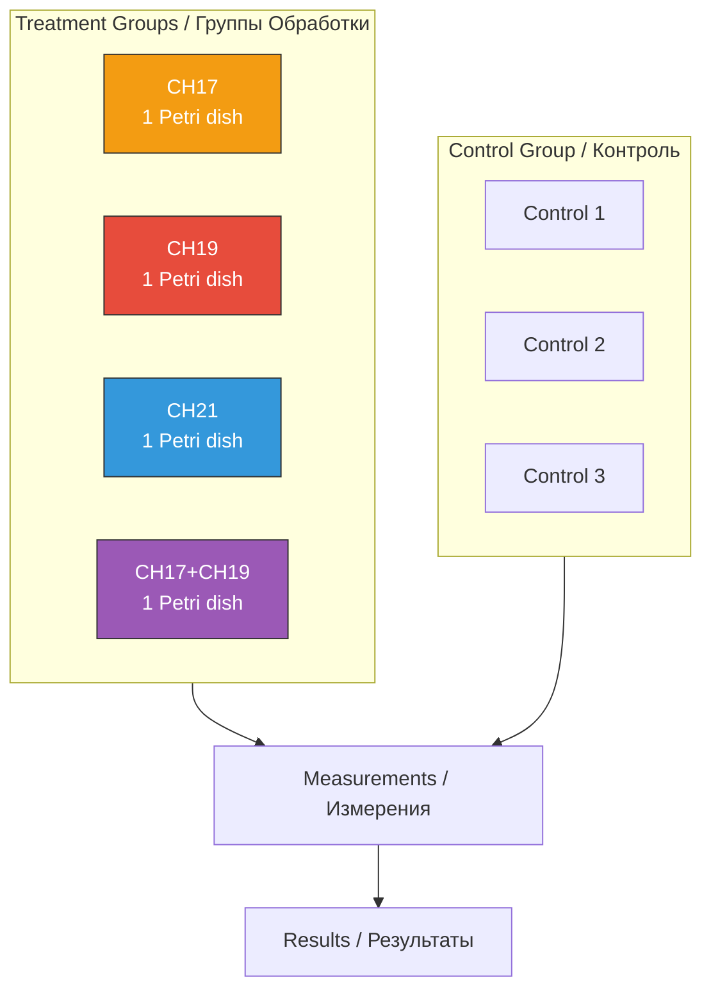
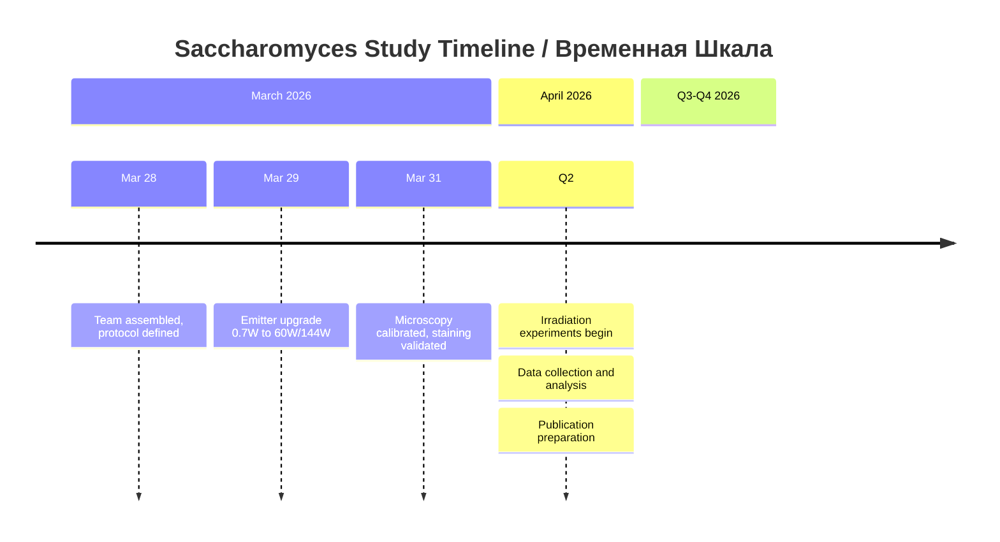
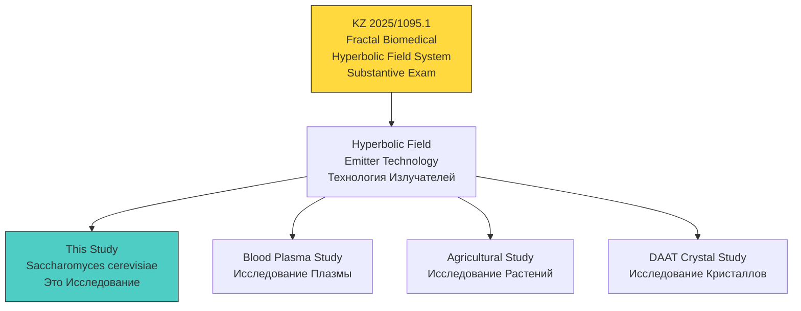

# Hyperbolic Field Saccharomyces Cerevisiae Study / Исследование Влияния Гиперболических Полей на Saccharomyces Cerevisiae

<div align="center">

**Fermentation Kinetics, Metabolic Rates & Temporal Process Dynamics Under Hyperbolic Field Exposure**

**Кинетика Ферментации, Скорость Метаболизма и Динамика Временных Процессов Под Воздействием Гиперболических Полей**

[](https://github.com/AdvancedScientificResearchProjects)
[]()
[]()

**Part of Advanced Scientific Research Projects (ASRP) Ecosystem**

**Часть Экосистемы ASRP**

</div>

---

## QUICK NAVIGATION / БЫСТРАЯ НАВИГАЦИЯ

| Section / Раздел | Description / Описание | Status / Статус |
|------------------|----------------------|-----------------|
| [Overview / Обзор](#overview--обзор) | Study objectives / Цели исследования | Defined / Определено |
| [Key Metrics / Метрики](#key-metrics--ключевые-метрики) | Study parameters / Параметры | Defined / Определено |
| [Hypotheses / Гипотезы](#hypotheses--гипотезы) | Channel-specific predictions / Предсказания по каналам | Defined / Определены |
| [Experimental Design / Дизайн](#experimental-design--экспериментальный-дизайн) | 7 samples, 4 channels / 7 образцов, 4 канала | Protocol ready |
| [Equipment / Оборудование](#equipment--оборудование) | Emitters, sensors, microscope / Излучатели, датчики, микроскоп | Upgraded / Обновлено |
| [Team / Команда](#research-team--команда) | 5 researchers / 5 исследователей | Assigned / Назначены |
| [Timeline / Сроки](#timeline--временная-шкала) | March-April 2026 | In progress / Идёт |
| [Patent Connection / Патент](#patent-connection--связь-с-патентом) | KZ 2025/1095.1 | Substantive Exam |
| [ASRP Ecosystem / Экосистема](#asrp-ecosystem--экосистема-asrp) | Related repos / Связанные репо | Linked |

---

## OVERVIEW / ОБЗОР

### EN

Irradiation study investigating the effects of hyperbolic field modulation on *Saccharomyces cerevisiae* (baker's yeast) as a model biological system. Yeast samples are exposed to hyperbolic field emissions on channels 17, 19, and 21, then observed for changes in fermentation dynamics, growth rate, morphology, and viability using methylene blue staining and microscopy.

This study builds on prior blood plasma coagulation experiments where CH19 produced the most advanced coagulation (including lysis), while CH21 lagged behind control.

### RU

Исследование облучения, изучающее влияние модуляции гиперболическими полями на *Saccharomyces cerevisiae* (пекарские дрожжи) как модельную биологическую систему. Образцы дрожжей подвергаются воздействию гиперболического поля на каналах 17, 19 и 21, затем наблюдаются изменения в динамике ферментации, скорости роста, морфологии и жизнеспособности с помощью окрашивания метиленовым синим и микроскопии.

Исследование основано на предыдущих экспериментах по свёртываемости плазмы крови, где CH19 показал наиболее выраженную коагуляцию (включая лизис), а CH21 отставал от контроля.

---

## KEY METRICS / КЛЮЧЕВЫЕ МЕТРИКИ

| Parameter / Параметр | Value / Значение |
|---------------------|-----------------|
| **Model Organism / Модельный организм** | *Saccharomyces cerevisiae* (Dr. Oetker dry yeast, 7g, batch L329 M68) |
| **Study Type / Тип исследования** | Irradiation study / Исследование облучения |
| **Irradiation Duration / Длительность облучения** | 80 minutes (1h 20m) per session |
| **Channels / Каналы** | CH17, CH19, CH21, CH17+CH19 |
| **Treatment Samples / Образцы обработки** | 4 Petri dishes / 4 чашки Петри |
| **Control Samples / Контрольные образцы** | 3 Petri dishes / 3 чашки Петри |
| **Emitter Power / Мощность излучателя** | 60W avg / 144W peak (upgraded from 0.7W) |
| **Emitter Nodes / Узлы излучателя** | 6 |
| **Temperature (Basement) / Температура (подвал)** | 10 C |
| **Temperature (Lab) / Температура (лаборатория)** | 18 C |
| **Viability Assay / Анализ жизнеспособности** | Methylene blue staining (0.1% MB + 0.01% sodium citrate) |
| **Logging Interval / Интервал логирования** | 1 measurement per minute (~80 per session) |
| **Patent / Патент** | KZ 2025/1095.1 (Fractal Biomedical Hyperbolic Field System) |

---

## HYPOTHESES / ГИПОТЕЗЫ

### H3: Directional Channel Hypothesis / Направленная Канальная Гипотеза

**EN:** CH19 exposure causes accelerated temporal progression of fermentation dynamics -- faster transition through lag, exponential, stationary, and decline phases. CH21 causes delayed or slowed phase transitions relative to control. Based on prior plasma observations.

**RU:** Воздействие CH19 вызывает ускоренную временную прогрессию динамики ферментации -- более быстрый переход через фазы лага, экспоненциального роста, стационарную и фазу спада. CH21 вызывает замедленные фазовые переходы относительно контроля. Основано на наблюдениях плазмы крови.

**Expected ranking / Ожидаемый порядок:** CH19 > Control > CH21 (or CH19 > CH21 > Control)

### H6: Immediate Morphological Effect / Немедленный Морфологический Эффект

**EN:** Hyperbolic field exposure may induce immediate observable changes (turbidity, texture, medium characteristics) during or immediately after exposure. Given yeast doubling time at 17 C substantially exceeds 80 minutes, this hypothesis is considered least likely.

**RU:** Воздействие поля может вызвать немедленные наблюдаемые изменения (мутность, текстура, характеристики среды). Учитывая, что время удвоения дрожжей при 17 C значительно превышает 80 минут, эта гипотеза считается наименее вероятной.

### H7: CH17 Uncertainty / Неопределённость CH17

**EN:** CH17 effect is unknown. Three possibilities: (a) directional effect consistent with but weaker/stronger than CH19, (b) qualitatively different changes (morphological rather than rate), (c) no measurable effect compared to control.

**RU:** Эффект CH17 неизвестен. Три возможности: (a) направленный эффект, согласованный с CH19, (b) качественно иные изменения (морфологические), (c) отсутствие измеримого эффекта.

### H12: Dose-Response (Future Study) / Доза-Ответ (Будущее Исследование)

**EN:** If effects are mediated by cumulative field exposure, repeated/extended exposure should produce proportionally larger effects. Not tested in current study.

**RU:** Если эффекты опосредованы кумулятивным полевым воздействием, повторное/продлённое воздействие должно давать пропорционально большие эффекты. Не тестируется в текущем исследовании.

---

## EXPERIMENTAL DESIGN / ЭКСПЕРИМЕНТАЛЬНЫЙ ДИЗАЙН

### Sample Groups / Группы Образцов



### Channel Predictions / Предсказания по Каналам

| Channel / Канал | Effect / Эффект | Plasma Precedent / Прецедент Плазмы |
|----------------|----------------|--------------------------------------|
| **CH19** | Accelerated fermentation phases / Ускорение фаз ферментации | Most coagulated + lysis / Максимальная коагуляция + лизис |
| **CH21** | Delayed fermentation phases / Замедление фаз ферментации | Lagged behind control / Отставал от контроля |
| **CH17** | Unknown -- 3 scenarios / Неизвестен -- 3 сценария | Found in blue whale research / Найден в исследовании голубых китов |
| **CH17+CH19** | Combined effect / Комбинированный эффект | Not tested in plasma / Не тестировался на плазме |

### Environment / Среда

| Parameter / Параметр | Value / Значение |
|---------------------|-----------------|
| **Location / Место** | Basement (-1 floor) / Подвал (-1 этаж) |
| **Lighting / Освещение** | Complete darkness during irradiation / Полная темнота при облучении |
| **Temperature / Температура** | 10 C (basement); 18 C (3rd floor lab) |
| **Light monitoring / Мониторинг света** | Photoresistors / Фоторезисторы |

### Observation Schedule / График Наблюдений

| Timepoint / Момент | Action / Действие |
|--------------------|-------------------|
| Before irradiation / До облучения | Photograph + microscopy |
| Immediately after / Сразу после | Photograph + microscopy |
| 3h post-exposure / 3ч после | Photograph |
| 6h | Photograph |
| 12h | Photograph + microscopy |
| 24h | Photograph + microscopy + staining |
| 48h | Photograph + microscopy + staining |

### Viability Assay / Анализ Жизнеспособности

**Methylene Blue Staining / Окрашивание Метиленовым Синим:**
- 0.1% methylene blue + 0.01% sodium citrate
- Dead cells stain blue / Мёртвые клетки окрашиваются синим
- Live cells remain unstained / Живые клетки не окрашиваются

---

## EQUIPMENT / ОБОРУДОВАНИЕ

| Equipment / Оборудование | Specification / Характеристики |
|--------------------------|-------------------------------|
| **Emitter System / Система излучателей** | 6 nodes, 60W avg / 144W peak, clean sine wave |
| **Temperature Sensors / Датчики температуры** | DHT11 digital (temp + humidity), placed next to each sample |
| **Light Sensors / Датчики света** | Photoresistors + ADC |
| **Microscope / Микроскоп** | Light microscope with strong LED illumination |
| **Data Center / Центр данных** | Linux-based microprocessor, 1 TB storage, auto-logging |
| **Containers / Ёмкости** | Petri dishes / Чашки Петри |
| **Staining Supplies / Реактивы** | Methylene blue 0.1%, sodium citrate 0.01%, glass slides |

---

## PRELIMINARY RESULTS / ПРЕДВАРИТЕЛЬНЫЕ РЕЗУЛЬТАТЫ

**Status / Статус:** Setup complete, microscopy calibrated / Установка завершена, микроскопия откалибрована

- Emitter power successfully upgraded from 0.7W to 60W avg / 144W peak
- Clean sine wave output confirmed (no noise/harmonics)
- DHT11 sensors calibrated at 1-minute logging intervals
- Yeast viability confirmed under microscope -- active cell division observed
- Methylene blue staining protocol validated -- clear live/dead differentiation
- Microscope photography workflow established (phone through eyepiece)

**Irradiation experiments not yet started / Эксперименты по облучению ещё не начаты**

---

## TIMELINE / ВРЕМЕННАЯ ШКАЛА



---

## OSF PREREGISTRATION / ПРЕДВАРИТЕЛЬНАЯ РЕГИСТРАЦИЯ OSF

| Field / Поле | Value / Значение |
|--------------|------------------|
| **Status / Статус** | Registration pending / Регистрация ожидается |
| **Platform / Платформа** | [OSF.io](https://osf.io) |

---

## PATENT CONNECTION / СВЯЗЬ С ПАТЕНТОМ



---

## RESEARCH TEAM / КОМАНДА

| Name / ФИО | Role / Роль | Responsibilities / Обязанности |
|-----------|------------|-------------------------------|
| **Denis Banchenko / Денис Банченко** | Project Lead / Руководитель | Coordination, OSF registration, workflow / Координация, OSF, рабочий процесс |
| **Valeria Ovsyannikova / Валерия Овсянникова** | Experimentalist / Экспериментатор | Hardware, emitter setup, microscopy, staining / Оборудование, установка, микроскопия, окрашивание |
| **Kyryl Zmiienko / Кирилл Змиенко** | Research Analyst / Аналитик | Hypothesis formulation, scientific analysis / Формулировка гипотез, научный анализ |
| **Ivan Savelyev / Иван Савельев** | Scientific Advisor / Научный советник | Data logging protocols, methodology review / Протоколы логирования, обзор методологии |
| **Mykhailo Kapustin / Михайло Капустин** | CTO | Data infrastructure / Инфраструктура данных |

---

## DATA STRUCTURE / СТРУКТУРА ДАННЫХ

```
Hyperbolic_Field_SaccharomycesCerevisiae_Study/
|
|-- README.md
|
|-- data/
|   |-- equipment/                     # Equipment photos / Фото оборудования
|   |   |-- msg063_photo_valeria_equipment.jpg
|   |   |-- msg064_photo_valeria_equipment2.jpg
|   |   `-- msg094_photo_dht11_sensor_layout.jpg
|   |-- microscopy/                    # Microscopy photos / Фото микроскопии
|   |   |-- msg174_photo_microscope_yeast_concentrate.jpg
|   |   |-- msg185_photo_microscope1.jpg
|   |   |-- msg186_photo_microscope2_reply185.jpg
|   |   `-- staining/                  # Methylene blue staining / Окрашивание
|   |       |-- msg188_photo_stained1.jpg
|   |       |-- msg189_photo_stained2.jpg
|   |       `-- msg190_photo_stained3_reply187.jpg
|   |-- sample-ch17/                   # Channel 17 sample / Образец канал 17
|   |   `-- photos/
|   |-- sample-ch19/                   # Channel 19 sample / Образец канал 19
|   |   `-- photos/
|   |-- sample-ch21/                   # Channel 21 sample / Образец канал 21
|   |   `-- photos/
|   |-- sample-ch17-19/                # Combined CH17+19 / Комбинированный
|   |   `-- photos/
|   |-- control-01/                    # Control group 1 / Контроль 1
|   |   `-- photos/
|   |-- control-02/                    # Control group 2 / Контроль 2
|   |   `-- photos/
|   `-- control-03/                    # Control group 3 / Контроль 3
|       `-- photos/
|
|-- charts/                            # Analysis charts / Графики анализа
|-- protocols/                         # Experiment protocols / Протоколы
|-- reports/                           # Analysis reports / Отчёты
`-- scripts/                           # Analysis scripts / Скрипты анализа
```

---

## ASRP ECOSYSTEM / ЭКОСИСТЕМА ASRP

<div align="center">

### Related Research Repositories / Связанные Исследовательские Репозитории

</div>

| Repository / Репозиторий | Direction / Направление | Link / Ссылка |
|-------------------------|------------------------|---------------|
| **Hyperbolic Field Blood Plasma Study** | Blood plasma coagulation (prior art) / Свёртываемость плазмы (предшествующее исследование) | [View / Просмотр](https://github.com/AdvancedScientificResearchProjects/Hyperbolic_Field_BloodPlasma_Study) |
| **Hyperbolic Field Emitter Programs** | Emitter control software / ПО управления излучателями | [View / Просмотр](https://github.com/AdvancedScientificResearchProjects/Hyperbolic_Field_Emitter_Programs) |
| **Hyperbolic Field Agricultural Study** | Plant & seed growth / Рост растений и семян | [View / Просмотр](https://github.com/AdvancedScientificResearchProjects/Hyperbolic_Field_Agricultural_Study) |
| **Hyperbolic Field DAAT Crystal Study** | Crystal-human interaction / Взаимодействие кристалл-человек | [View / Просмотр](https://github.com/AdvancedScientificResearchProjects/Hyperbolic_Field_DAAT_Crystal_Study) |
| **ASRP.art** | Art & consciousness / Искусство и сознание | [View / Просмотр](https://github.com/AdvancedScientificResearchProjects/Axionetic_Sensing_Reactions_Platform_in_Art) |
| **UAP Reverse Engineering** | UAP analysis / Анализ НЛО | [View / Просмотр](https://github.com/AdvancedScientificResearchProjects/UAP_Reverse_Engineering_Study) |

<div align="center">

### Patent Portfolio / Патентный Портфель

</div>

| Patent / Патент | Application / Заявка | Link / Ссылка |
|----------------|---------------------|---------------|
| **Fractal Biomedical System** | KZ 2025/1095.1 | [View / Просмотр](https://github.com/denisbanchenko/Kazpatent_Fractal_Biomedical_System_Patent) |
| **ASRP.art** | KZ 2025/0592.1 + PCT | [View / Просмотр](https://github.com/denisbanchenko/Kazpatent_Axionetic_Sensing_Reactions_Platform_in_Art_Patent) |
| **ASRP.drift** | KZ 413554 | [View / Просмотр](https://github.com/denisbanchenko/Kazpatent_Advanced_Synchro_Resonance_Platform_For_Deep_Resonant_Patent) |
| **GFS** | KZ 2025/1096.1 | [View / Просмотр](https://github.com/denisbanchenko/Kazpatent_Global_Forecasting_System_Patent) |
| **Inspira-X** | KZ 2025/0914.1 | [View / Просмотр](https://github.com/denisbanchenko/Kazpatent_Inspira-X_Respiratory_Analysis_Patent) |
| **Biophotonic** | KZ 2025/1097.1 | [View / Просмотр](https://github.com/denisbanchenko/Kazpatent_Biophotonic_Neurodiagnostic_System_Patent) |

---

## CONTACT INFORMATION / КОНТАКТНАЯ ИНФОРМАЦИЯ

| Field / Поле | Value / Значение |
|--------------|------------------|
| **Organization / Организация** | Advanced Scientific Research Projects LLP / ТОО "Перспективные Научно-Исследовательские Разработки" |
| **Address / Адрес** | Komarova St. 37, Apt 56, Baikonur, 468320 / Ул. Комарова 37, кв. 56, г. Байконур, 468320 |
| **Country / Страна** | Republic of Kazakhstan / Республика Казахстан |
| **Website / Веб-сайт** | [asrp.tech](https://asrp.tech) |
| **Email** | info@asrp.tech |

---

<div align="center">

**Last Updated / Последнее обновление:** April 2026

**Status / Статус:** Setup Complete, Irradiation Pending / Установка завершена, облучение ожидается

</div>

---

## TBD

- Petri dish photos from experiments / Фото чашек Петри
- Irradiation experiment results / Результаты облучения
- OSF preregistration link / Ссылка OSF

---

## NAVIGATION INDEX / НАВИГАЦИОННЫЙ ИНДЕКС

[Overview / Обзор](#overview--обзор) · [Key Metrics / Метрики](#key-metrics--ключевые-метрики) · [Hypotheses / Гипотезы](#hypotheses--гипотезы) · [Experimental Design / Дизайн](#experimental-design--экспериментальный-дизайн) · [Equipment / Оборудование](#equipment--оборудование) · [Preliminary Results / Результаты](#preliminary-results--предварительные-результаты) · [Timeline / Сроки](#timeline--временная-шкала) · [Patent Connection / Патент](#patent-connection--связь-с-патентом) · [Team / Команда](#research-team--команда) · [Data Structure / Структура](#data-structure--структура-данных) · [ASRP Ecosystem / Экосистема](#asrp-ecosystem--экосистема-asrp) · [Contact / Контакты](#contact-information--контактная-информация)
