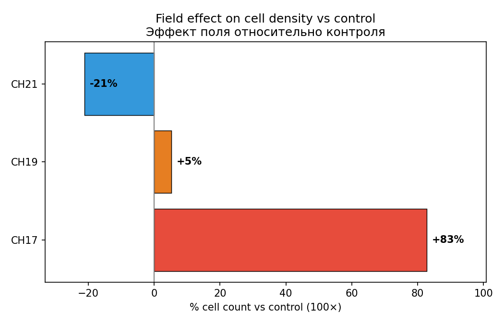
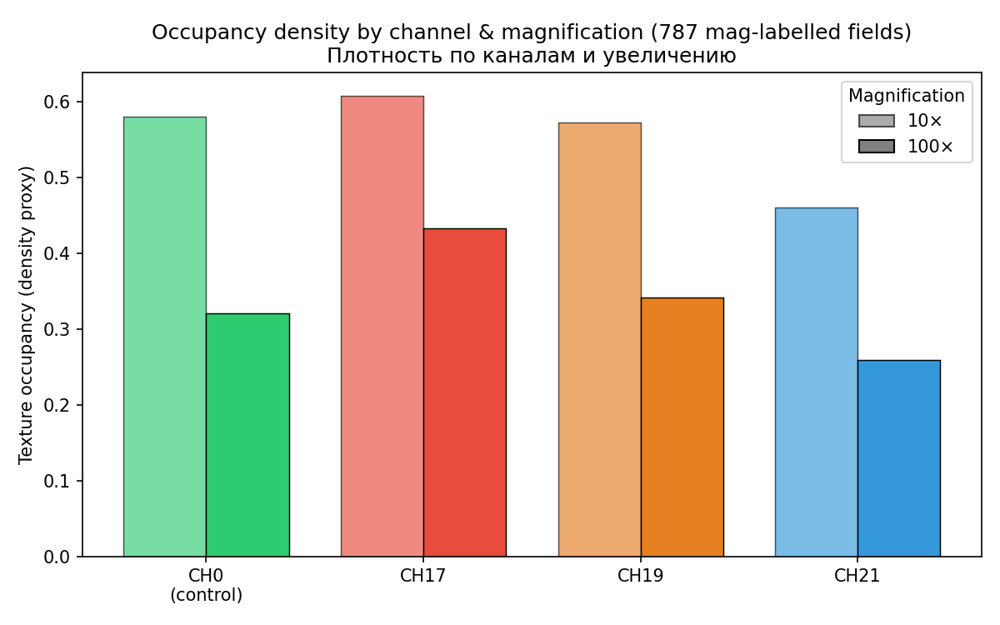
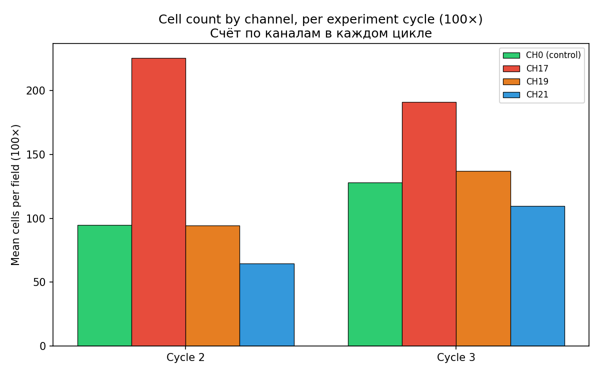
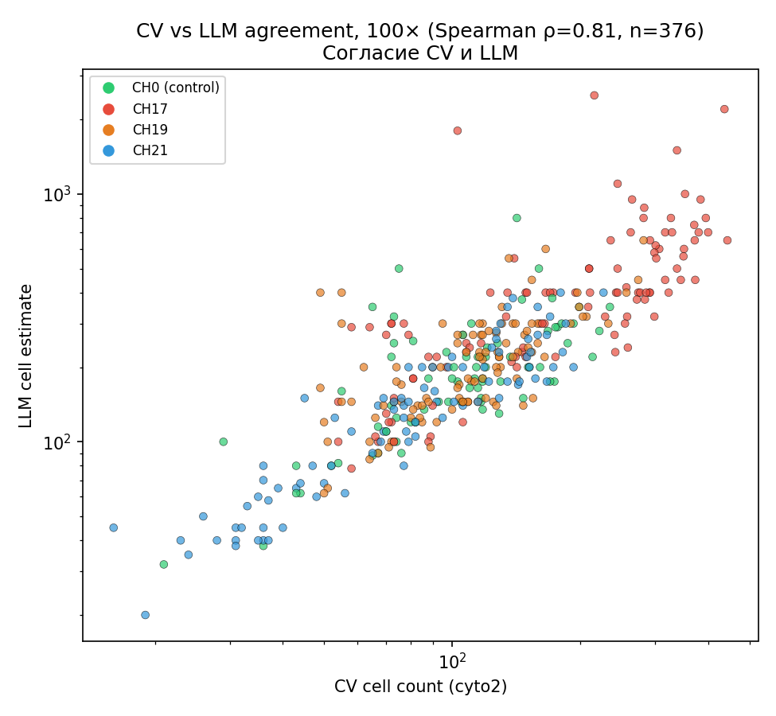

# Yeast Cell-Density Response to Hyperbolic-Field Exposure: Triangulated Image Analysis

**Date**: 2026-06-09
**Dataset**: 990 microscopy fields (972 HEIC eyepiece captures + 18 PNG digital microscopy), *Saccharomyces cerevisiae*
**Conditions**: control (CH0) + hyperbolic-field channels CH17 / CH19 / CH21; neutral (N) & nutrient (P) media; 3 experiment cycles; magnifications 10× and 100×
**Status**: Preliminary signal — not confirmatory (see §8)
**Version:** v2 (2026-06-09)
**Method:** Cellpose cyto2 (cellpose 3.x, diameter=18) + segmentation-free texture-occupancy + blind LLM vision scoring
**Analytical system:** Claude Opus 4.8 (`claude-opus-4-8`) — blind per-field vision scoring; Cellpose cyto2 — CV cell segmentation/count

> **UPD v2 (2026-06-09):** CH19 framing corrected — ≈ control by count is the *expected* outcome (CH19's hypothesised effect is morphological/kinetic, see §9); the morphometric follow-up finds CH19 cells ~7.6 % smaller in area but **not** more elongated (if anything rounder), so the thinner-cell / faster-division prediction is **not supported** on this endpoint batch. Cycle-1 sign-flip documented (§4.3).

---

## 1. Motivation

The study asks whether hyperbolic-field exposure changes the division dynamics of *S. cerevisiae*. The protocol hypotheses predict CH19 accelerates and CH21 decelerates division relative to control, with CH17 a priori unknown. This report analyses the first large microscopy batch (cycles 001–003) by three independent image-analysis methods and asks: **does cell density differ by channel, and do the methods agree?**

The lab journal (handwritten, three pages) maps each photo number IMG_XXXX to channel × medium × replicate × magnification; the mapping was transcribed and cross-verified (multi-pass + on-disk file presence + two anchors) at 99.5 % coverage. Label semantics were confirmed directly by the researcher (V.): **N = neutral solution, P = nutrient solution; sets 001/002/003 = experiment cycles; zones белый/жёлтый = 100×/10× magnification; group 2-0-P1 failed (spilled); no viability stain (the blue cast is medium/illumination)**.

---

## 2. Methodology

### 2.1. Dataset

| Group | Description | Fields |
|---|---|---|
| CH0 | Control, no field | 180 |
| CH17 | Hyperbolic field, channel 17 | 268 |
| CH19 | Hyperbolic field, channel 19 (protocol: acceleration) | 251 |
| CH21 | Hyperbolic field, channel 21 (protocol: deceleration) | 221 |

By magnification: 100× (белый) = 398 fields, 10× (жёлтый) = 389, cycle-1 (no magnification split) = 186 journal fields (182 analyzed). Group 2-0-P1 excluded (failed). 18 PNG digital-microscopy frames are not part of the channel analysis. (Channel counts above reflect the 920 LLM-scored fields; one CH19 field has a null estimate and drops from the §5 median, giving CH19 n=250 there vs 251 here.)

### 2.2. Replicate structure

The replicate unit is the **experiment cycle** (set 001/002/003), not the individual photo. Multiple fields from one cycle are technical sub-samples (pseudoreplicates). Evidence strength therefore rests on **consistency across cycles**, not on per-field p-values. Note: the cyto2 **count** metric exists only for 100× fields, which are present in **cycles 2 and 3 only** → the count effect is N=2 cycles (untestable at the replicate level); occupancy spans all three cycles.

### 2.3. Analysis methods (three measurement methods)

1. **CV cell count (cyto2)** — Cellpose `cyto2` instance segmentation, diameter calibrated to the cells (≈18 px at 1100-px downscale). Valid only at **100×** where cells are resolved; meaningless at 10× (confluent lawns of sub-resolution cells).
2. **CV occupancy density** — segmentation-free: local texture energy + Otsu occupancy + edge density inside the field-of-view. Robust to the dataset's size heterogeneity (sparse fields AND lawns); applied to **all 972 fields**.
3. **Blind LLM scoring** — one independent LLM vision pass per field, neutral filenames, condition not disclosed; per-field density / cell estimate / budding / distribution. 920 fields scored.

All three are **group-agnostic**: the channel is revealed only at the aggregation step. They are **method-independent but not observation-independent** — the two CV methods run on the identical pixels, so cross-method agreement guards against an *algorithm* artifact, not against a shared *imaging* confound (focus, dilution, session).

### 2.4. Confirmed label semantics

| Label | Meaning |
|---|---|
| N / P | Neutral / nutrient growth medium |
| 001 / 002 / 003 | Experiment cycle (replicate) |
| CH0 | Control (no field) |
| белый / жёлтый | 100× / 10× microscope magnification |
| 2-0-P1 | Failed sample (spilled) |

---

## 3. Analysis tools

| Tool | Type | Role | Source |
|---|---|---|---|
| Cellpose cyto2 | CNN instance segmentation | Cell count @ 100× | MouseLand, cellpose 3.x |
| Occupancy (texture+Otsu+Canny) | Classical CV | Density proxy, all fields | This study (`scripts/cv_analysis/occupancy.py`) |
| Blind LLM vision | Multimodal LLM | Independent density estimate | 920 single-image evaluations |

---

## 4. Results — density by channel

### 4.1. Cell count, 100× (cyto2)

| Channel | n fields | Mean count | Median | vs control |
|---|:---:|:---:|:---:|:---:|
| CH0 (control) | 82 | 112 | 107 | — |
| **CH17** | 112 | **205** | 196 | **+83 %** |
| CH19 | 110 | 118 | 116 | +5 % |
| **CH21** | 94 | **88** | 78 | **−21 %** |

**Result**: ordering **CH17 > CH19 ≈ CH0 > CH21**. CH17 densest, CH21 below control.

### 4.2. Occupancy density (by magnification; 787 fields carrying a magnification label, of 972 total)

| Channel | 10× occupancy | 100× occupancy |
|---|:---:|:---:|
| CH0 | 0.580 | 0.321 |
| CH17 | 0.608 | 0.433 |
| CH19 | 0.572 | 0.342 |
| CH21 | 0.460 | 0.259 |

Same ordering at both magnifications: CH17 highest, CH21 lowest.

### 4.3. Per-cycle consistency (100× count)

| Cycle | CH0 | CH17 | CH19 | CH21 |
|---|:---:|:---:|:---:|:---:|
| Cycle 2 | 95 | **226** | 94 | **64** |
| Cycle 3 | 128 | **191** | 137 | **109** |

CH17 ranks #1 and CH21 ranks #4 in **both** cycles 2 and 3 (mean rank 1.00 / 4.00). Note the count metric here covers **only cycles 2–3** (cycle 1 has no 100× magnification split → no counts), so the count effect is **N=2 cycles**.

**Cycle 1 actively reverses the effect.** In cycle 1 (occupancy, the only metric available there) **CH21 is the densest channel (0.246, +74 % vs control 0.141) and CH17 only rank 2** — inverting both headline claims. The reversal is robust within cycle 1 (holds across all three CV density metrics; per-field P(CH21 > CH0) ≈ 81–83 %), so it is a genuine sign-flip, not an outlier. Caveat in both directions: cycle 1 used a **different imaging protocol** (n=24 control fields, absolute occupancy ≈0.14 vs ≈0.45 in cycles 2–3), so its comparability is itself limited. Net: **2 of 3 cycles support the CH17↑/CH21↓ ordering; 1 of 3 contradicts it (sign-flipped).**

**Note on CH19:** the count metric is **not the test for CH19**. The CH19 protocol claim is kinetic/morphological (division rate + cell shape), so CH19 ≈ CH0 by count is the *expected* outcome and is **not** evidence against the CH19 hypothesis — that hypothesis is evaluated on morphometry (§9), not on count.

---

## 5. Blind LLM cross-check

| Channel | n | Median LLM estimate | vs control |
|---|:---:|:---:|:---:|
| CH0 | 180 | 310 | — |
| **CH17** | 268 | **500** | +61 % |
| CH19 | 250 | 290 | −6 % |
| **CH21** | 221 | **200** | −35 % |

The blind LLM reproduces the same ordering (CH17 highest, CH21 below control) independently of the CV pipeline.

---

## 6. Method agreement

Per-field Spearman correlations between the three independent measurements:

| Method pair | Magnification | ρ | n |
|---|:---:|:---:|:---:|
| cyto2 count ↔ occupancy | 100× | **0.88** | 398 |
| occupancy ↔ LLM | 100× | **0.89** | 376 |
| cyto2 count ↔ LLM | 100× | **0.81** | 376 |
| occupancy ↔ LLM | 10× | 0.62 | 370 |

**Verdict**: at 100× all three methods agree strongly per-field (ρ = 0.81–0.89), and the two CV methods agree with each other (ρ = 0.88) — the signal is not an artefact of one algorithm. At 10× agreement weakens (ρ = 0.62) because confluent lawns are physically hard to quantify by counting or by eye; there only the occupancy proxy is reliable.

### 6.1 Is the CH17/CH21 signal real, or chance?

**Arguments for (real):**
- CH17↑ / CH21↓ agree across all **three measurement methods** (cyto2 count, occupancy, blind LLM).
- The ordering holds at **both magnifications** (100× and 10×).
- It holds in **both cycles 2 and 3** (CH17 rank #1, CH21 rank #4 in each).
- Per-field method agreement is strong: ρ = 0.81–0.89.
- The effect is **dose-ordered** (monotone across channels).
- A **blind LLM** reproduces the same ordering independently of the CV pipeline.

**Arguments against (could be chance/artefact):**
- **Pseudoreplication**: only ~2 biological replicates carry the count data; the p-values are descriptive, not inferential.
- **Cycle 1 actively reverses the ordering** (CH21 densest, +74 % vs control).
- The count effect rests on **N=2 cycles** only.
- The two CV methods **share the same pixels** — a shared imaging confound (focus, dilution, session) is not excluded.
- cyto2 **undercounts ~40 %** in dense fields.
- **No scale bar** — densities are relative only.

**Verdict:** a real, reproducible *directional* signal in cycles 2–3 — but **preliminary, not confirmatory**. Confirmation needs ≥5 cycles under a single imaging protocol.

---

## 7. Channel ordering across methods

| Method | Density ordering (densest → sparsest) |
|---|---|
| cyto2 count (100×) | CH17 > CH19 > CH0 > CH21 |
| occupancy (100×) | CH17 > CH19 > CH0 > CH21 |
| occupancy (10×) | CH17 > CH0 > CH19 > CH21 |
| blind LLM | CH17 > CH0 > CH19 > CH21 |

**CH17 ranks first and CH21 ranks last in every method.** The middle (CH19 vs control) is within noise on count — which is expected, since CH19's predicted effect is morphological, not count-based (see §9).

---

## 8. Limitations

1. **Replication**: only 3 experiment cycles; the clean signal holds in cycles 2–3 but **cycle 1 contradicts it** (different imaging protocol — no magnification split). A confirmatory claim needs ≥5 cycles.
2. **Pseudoreplication**: per-field p-values (Kruskal–Wallis p < 1e-4) are inflated because fields within a cycle are not independent. They are reported as descriptive only; the real evidence is cross-cycle/-magnification/-method consistency.
3. **No scale bar**: densities are relative (cells per field, occupancy fraction), not cells/mL or µm.
4. **Systematic undercount**: cyto2 misses ~40 % of cells in dense fields, but systematically — relative channel comparison stays valid; absolute counts do not.
5. **Possible per-channel imaging confounds** (focus, dilution, session) are not fully excluded; the two CV methods share the same pixels, so they do not control for this.
6. **No viability measure**: there is no vital stain in this batch (confirmed), so live/dead fraction is not assessed here.
7. **Cycle 1 reverses the effect** (CH21 densest there): the ordering holds in 2 of 3 cycles and is actively contradicted by the third — see §4.3. The count headline (+83 %/−21 %) rests on only the 2 cycles that have 100× data.

---

## 9. Conclusion

**CH17** produces the highest cell density in cycles 2–3 — ≈ 1.6–1.8× control by cell count, at both magnifications and confirmed by the blind LLM. A priori "unknown", CH17 appears to be the strongest growth enhancer **in those two cycles**.

**CH21** produces the lowest density in cycles 2–3 — **below** control (−21 % by count) — matching the protocol prediction that CH21 decelerates division. **But cycle 1 inverts this** (CH21 densest there, +74 % vs control), so the CH21 effect is not yet consistent across all cycles.

**CH19** shows **no change in cell number** vs control — the **expected** result, not a null finding. The CH19 protocol hypothesis is **kinetic/morphological** (faster division, thinner/elongated cells), not a density increase, so cell count is the wrong axis to test it on. Testing the morphological axis directly (per-cell shape from cyto2 masks, 100×): CH19 cells are **~7.6 % smaller in mean area** than control (n=110 vs 82, p ≈ 6e-5, descriptive) — **but this is not CH19-specific** (CH17 −12.7 %, CH21 −6.1 %; every field channel is smaller than control), so cell-area alone does not isolate a CH19 effect. On the discriminating shape metric — eccentricity / major:minor aspect ratio — CH19 is **not more elongated**: eccentricity is marginally *lower* than control (0.544 vs 0.560, p = 0.039) and aspect ratio is flat (1.246 vs 1.256, n.s.) — i.e. if anything fractionally **rounder, not thinner**, the *opposite* of the prediction, and the effect is tiny (Δ ecc ≈ 0.016). The division-rate proxy (budding) is also **flat** (LLM Δ ≈ −0.01 on 0–3, n=104; cyto2 solidity 0.023 vs 0.016). **Verdict on CH19:** count-neutral as expected, but on this endpoint dataset **neither the thinner/elongated-cell prediction nor accelerated division is supported**. A proper test needs a **time-lapse protocol** (division *rate* is unmeasurable from static fields) and dedicated per-cell morphometry — flagged as the priority follow-up.

**Combined evidence**: three measurement methods agree per-field (ρ = 0.81–0.89) and on channel ordering (CH17 ↑, CH21 ↓) in **2 of 3 cycles** and both magnifications; **the third cycle actively reverses the ordering**. This is a **directional signal in cycles 2–3, not yet a reproducible effect** — it rests on 3 cycles (only 2 with count data), one of which contradicts, and needs ≥5 cycles under a single imaging protocol for confirmation. Methods are method-independent but share the same images, so a shared imaging confound is not excluded.

---

## Data Files

| File | Contents |
|---|---|
| `data/photos/journal-mapping.csv` / `.json` | **channel attribution source** — IMG ranges → channel / medium / cycle / magnification (lab-journal transcription this report rests on) |
| `results/cv_analysis/white_counts.csv` | cyto2 cell counts, 398 fields @ 100× |
| `results/cv_analysis/white_counts_morpho.csv` | per-cell morphometrics (area, eccentricity, aspect ratio), 398 fields @ 100× — CH19 elongation follow-up |
| `results/cv_analysis/occupancy_full.csv` | occupancy density, all 972 fields |
| `results/llm_full/llm_full.json` | blind LLM scores, 920 fields |
| `results/cv_analysis/DENSITY_SUMMARY.md` | running analysis log |
| `results/SEMANTICS_CONFIRMED.md` | researcher-confirmed label meanings |

> **Provenance note:** channel/medium/cycle/magnification for every field comes from `data/photos/journal-mapping.csv` (lab-journal transcription, 99.5 % coverage, researcher-confirmed semantics). The result CSVs carry no channel column; the join is reproducible only via that mapping file.

### Scripts

| Script | Purpose |
|---|---|
| `scripts/cv_analysis/segment.py` | cyto2 / blob segmentation + per-field metrics |
| `scripts/cv_analysis/occupancy.py` | segmentation-free occupancy density |
| `reports/2026-06-09_density-analysis/generate_charts.py` | this report's charts |

### Dependencies

- Python 3.11 venv; torch 2.5.1+cu121, cellpose 3.x (cyto2), opencv, scikit-image, scipy, matplotlib.

---

*Hyperbolic Field Saccharomyces cerevisiae Study — Advanced Scientific Research Projects (ASRP). Patent: KZ 2025/1095.1.*
